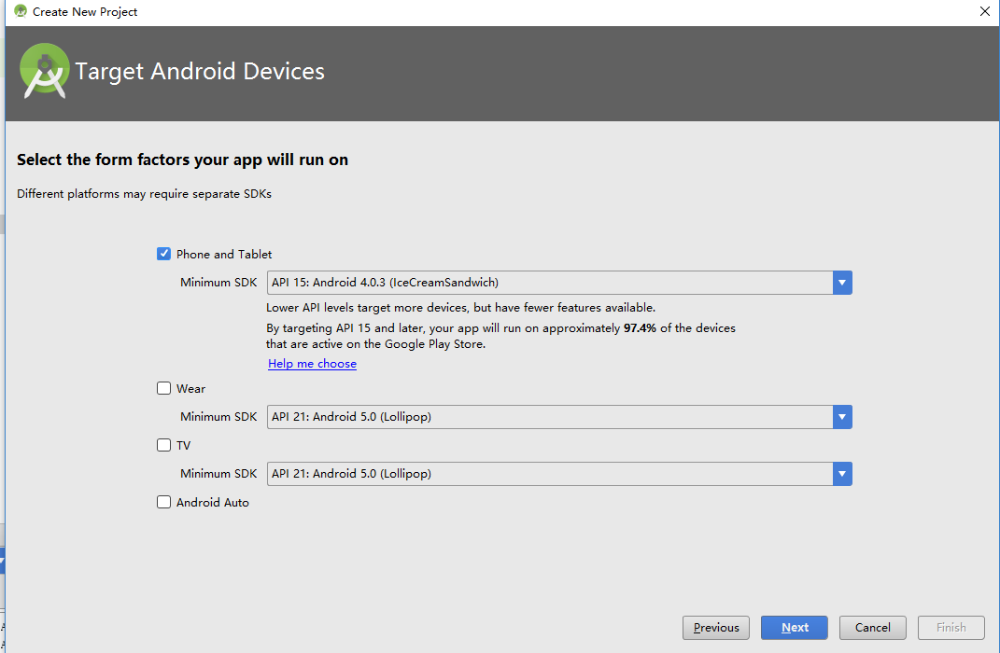
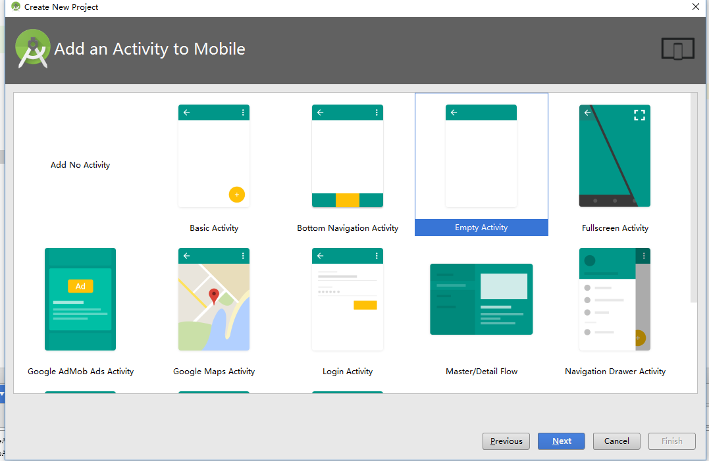
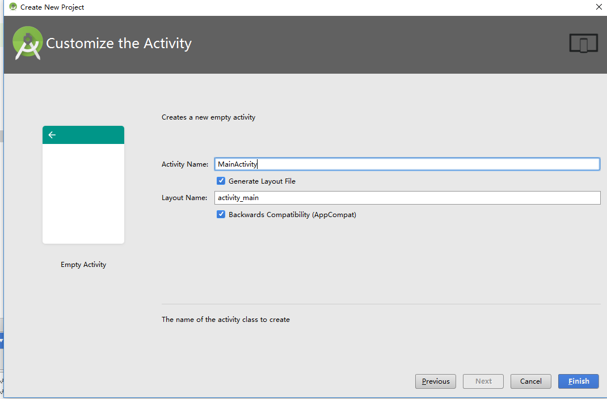
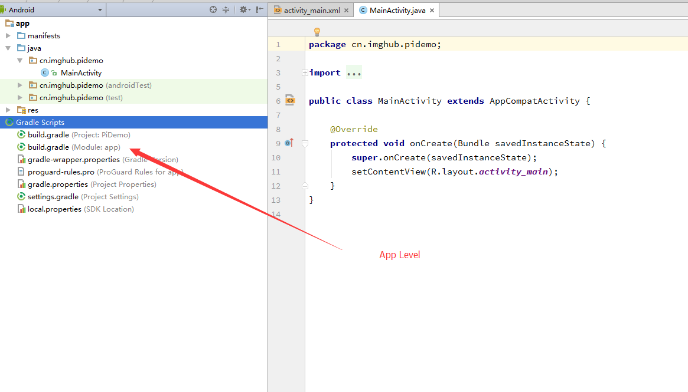
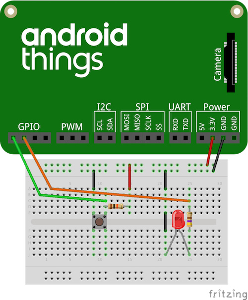
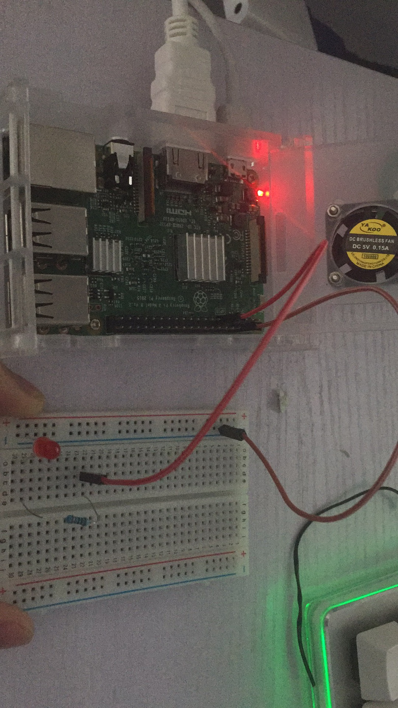
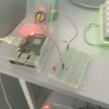

---

title: Android Things控制LED灯

date: 2017-4-2 15:37:33

tags:
	- raspberry
	- 树莓派
    - Antroid things
    - LED灯

categories: Raspberry

---


# 准备

1. 硬件

	- 树莓派3b
	- 两条杜邦线
	- 一个面包板
	- 一个LED灯珠
	- 一个300欧姆电阻

2. 软件

    - Android Studio
    - SDK及SDK tools （升级到API24或更高）
    - Gradle 2.3
<!--more-->

# GO

	## 使用Android Studio新建一个项目

 
 
 
 

 ## 添加Android Things类库
 1. 在app级别的build.gradle 文件中添加：
 ```
 dependencies {
    ...
    provided 'com.google.android.things:androidthings:0.2-devpreview'
}
 ```
 

 2.在应用的manifest文件中添加共享类库
 ```
 <application ...>
    <uses-library android:name="com.google.android.things"/>
    ...
</application>
 ```
## 声明一个主Activity

```
<application
    android:label="@string/app_name">
    <uses-library android:name="com.google.android.things"/>
    <activity android:name=".HomeActivity">
        <!-- Launch activity as default from Android Studio -->
        <intent-filter>
            <action android:name="android.intent.action.MAIN"/>
            <category android:name="android.intent.category.LAUNCHER"/>
        </intent-filter>

        <!-- Launch activity automatically on boot -->
        <intent-filter>
            <action android:name="android.intent.action.MAIN"/>
            <category android:name="android.intent.category.IOT_LAUNCHER"/>
            <category android:name="android.intent.category.DEFAULT"/>
        </intent-filter>
    </activity>
</application>
```
第一个intent-filter 会将MainActivity设为应用启动时的Activity,第二个intent-filter会将MainActivity设为设备（树莓派中的Android Things）设为默认的Activity

## 连接

 
 这张为[官网](https://developer.android.com/things/training/first-device/connect-hardware.html)教程给出的图，但是多了开关，所有多了个插+极的线
 
 - 使用杜邦线链接3号（GND 接地）和-极（插哪个没关系），11号（BCM17注意这个名称，程序里将会用到，别的GPIO接口也可以，记住名称）与面包版上22（哪个都可以）号的c（abcde都可以，一根线上的）
 - 将led灯插到29号（哪个都可以）的a（bcde。。也都行，led腿够长的话）和同排的负极(29旁边的)
 - 将电阻插入29与22的插口

此时，电路连接就完成了

## 编码让LED灯闪烁

1.使用PeripheralManagerService 打开GPIO接口的连接
2.配置接口为DIRECTION_OUT_INITIALLY_Low
3.改变LED的状态（接口的状态）
4.使用一个处理程序(handle)去持续触发led灯状态的改变（延迟1000毫秒）
5.当应用关闭时，关闭GPIO的资源(onDestroy方法)

```
public class BlinkActivity extends Activity {
    private static final String TAG = "BlinkActivity";
    private static final int INTERVAL_BETWEEN_BLINKS_MS = 1000;
    private static final String LED_PIN_NAME = ...; // GPIO port wired to the LED

    private Handler mHandler = new Handler();

    private Gpio mLedGpio;

    @Override
    protected void onCreate(Bundle savedInstanceState) {
        super.onCreate(savedInstanceState);

        // Step 1. Create GPIO connection.
        PeripheralManagerService service = new PeripheralManagerService();
        try {
            mLedGpio = service.openGpio(LED_PIN_NAME);
            // Step 2. Configure as an output.
            mLedGpio.setDirection(Gpio.DIRECTION_OUT_INITIALLY_LOW);

            // Step 4. Repeat using a handler.
            mHandler.post(mBlinkRunnable);
        } catch (IOException e) {
            Log.e(TAG, "Error on PeripheralIO API", e);
        }
    }

    @Override
    protected void onDestroy() {
        super.onDestroy();

        // Step 4. Remove handler events on close.
        mHandler.removeCallbacks(mBlinkRunnable);

        // Step 5. Close the resource.
        if (mLedGpio != null) {
            try {
                mLedGpio.close();
            } catch (IOException e) {
                Log.e(TAG, "Error on PeripheralIO API", e);
            }
        }
    }

    private Runnable mBlinkRunnable = new Runnable() {
        @Override
        public void run() {
            // Exit if the GPIO is already closed
            if (mLedGpio == null) {
                return;
            }

            try {
                // Step 3. Toggle the LED state
                mLedGpio.setValue(!mLedGpio.getValue());

                // Step 4. Schedule another event after delay.
                mHandler.postDelayed(mBlinkRunnable, INTERVAL_BETWEEN_BLINKS_MS);
            } catch (IOException e) {
                Log.e(TAG, "Error on PeripheralIO API", e);
            }
        }
    };
}
```

## 运行
	-adb 工具连接树莓派的ip地址
    -Shift+F10后选择树莓派



# 参考
- [官网教程](https://developer.android.com/things/training/first-device/index.html)
- [一篇博客](http://www.wutianqi.com/?p=3629),只看前面就好了


