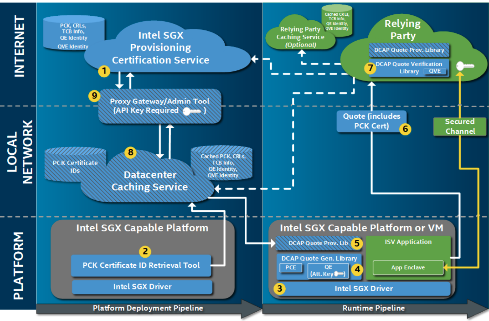
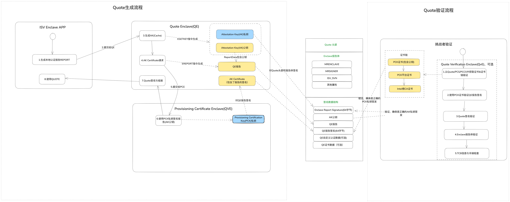
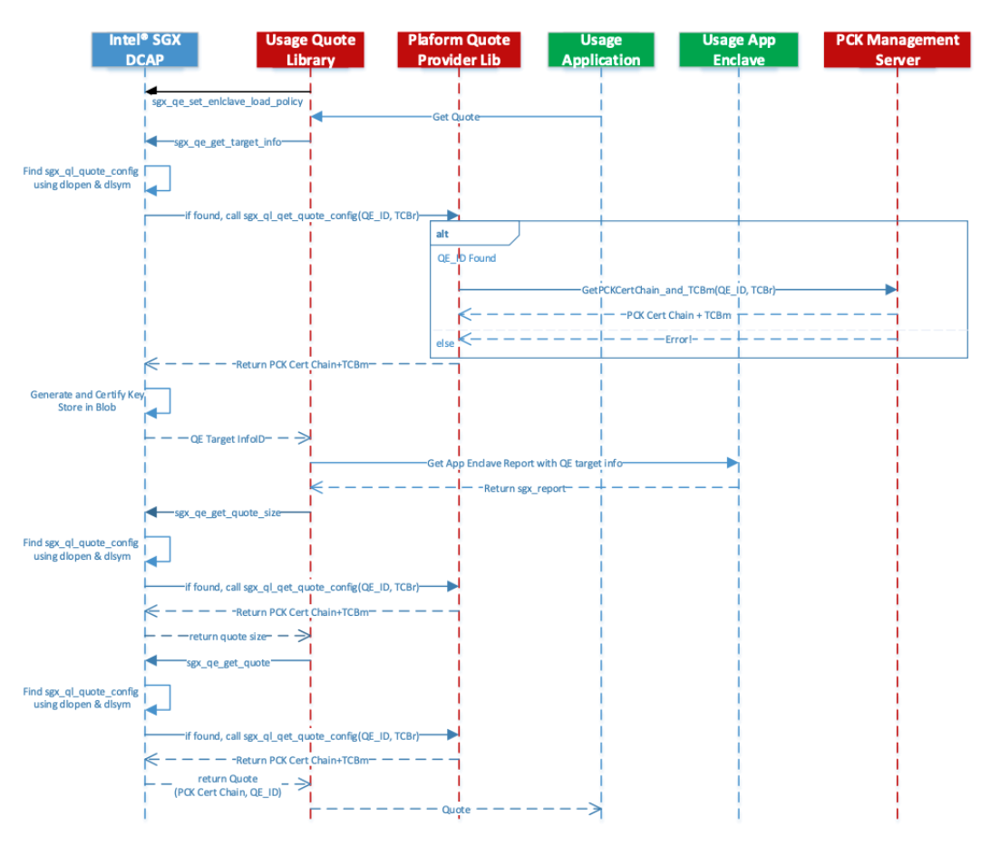
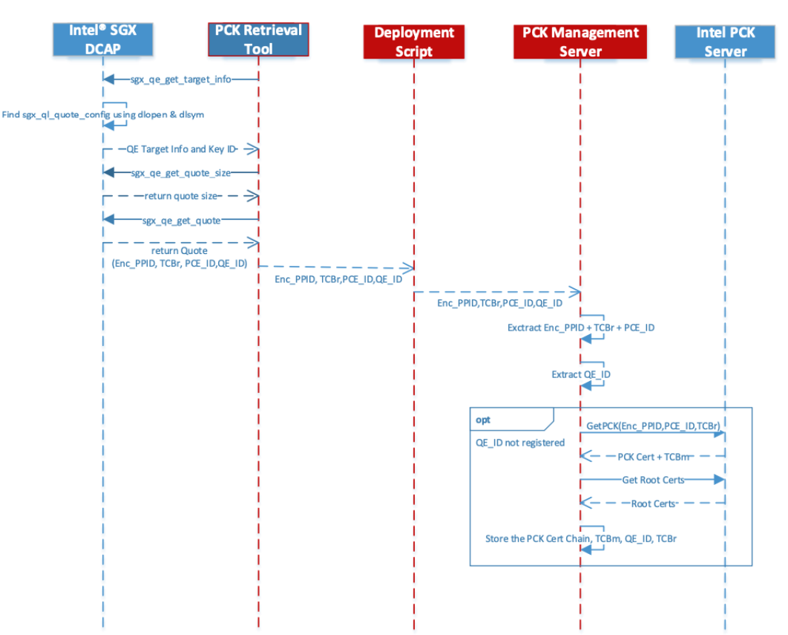
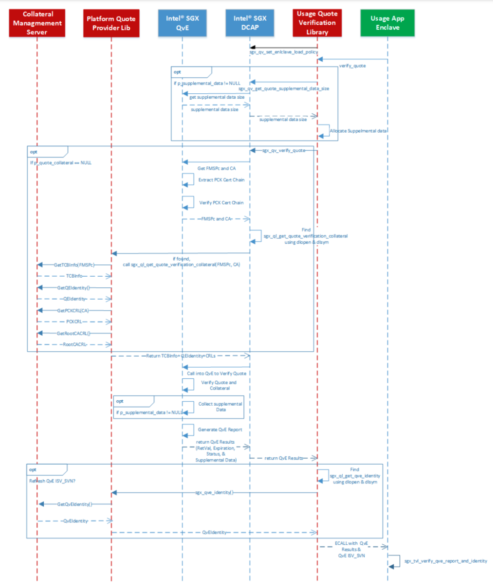
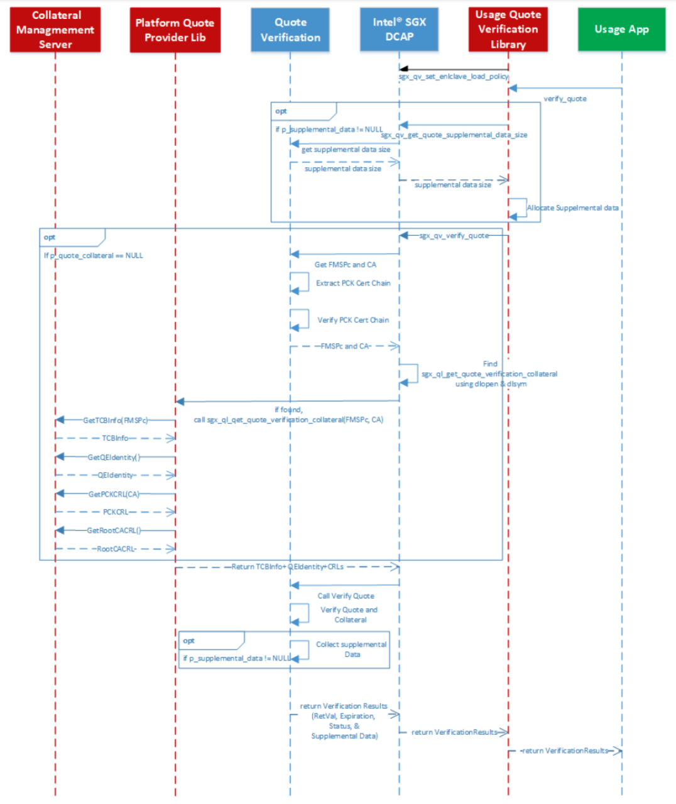
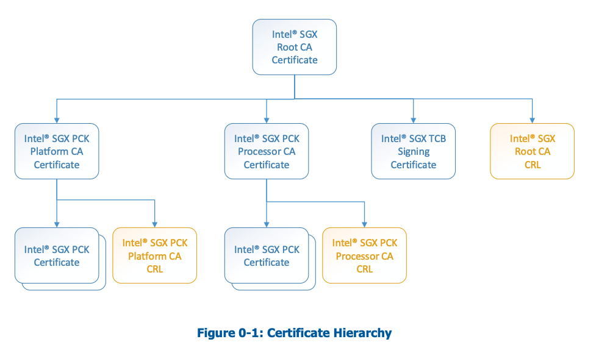

# 本文目的
Intel 提供了一套使用基于Intel 信任根的完整的认证架构基础设施，但是使用过程中不太理解实现技术细节，对一些工具的使用和安全保护的理解也就停留在表面。阅读一些文档后，了解了Intel DCAP（Data Center Attestation Primitives）方案是如何证明应用就是运行在TEE中的:如何产生证明证据（Quote），如何验证证明证据，又是如何达到信任闭环的，通过本文做一些记录。

# 简介

证明（Attestation）是验证软件运行在一个特定平台上的过程。Intel SGX 证明能允许参与方（数据方、审计方、验证方）确保特定的软件是运行在SGX平台的enclave中。

<!--more-->

# 术语

将术语分为三类，方便理解

## 基础类

| 名词                                                 | 解释                                                                                                |
| -------------------------------------------------- | ------------------------------------------------------------------------------------------------- |
| Elliptic Curve Digital Signature Algorithm (ECDSA) | 椭圆曲线数字数字签名算法                                                                                      |
| Platform Provisioning ID(PPID)                     | 用于唯一标识处理器封装或平台实例的ID。PPID不属于TCB，主要作用是识别而不是保护。                                                      |
| Security Version Number (SVN)                      | 是一个安全版本号，它指示合适发生了安全相关的更新。功能版本更新不会修改安全版本号。                                                         |
| Platform Security Version Numbers(PSVN)            | 为所有在SGX TCB的组件设置SVN，包括PCE SVN                                                                     |
| Enclave Page Cache(EPC)                            | Enclave页缓存，专门分配给Enclave使用的内存区域，用于存储Enclave的代码和数据                                                  |
| Intel® SGX Provisioning TCB                        | 可信计算基、包含HW TCB和PCE SVN                                                                                  |
| PCEID                                              | PCE版本，用于生成PPID和PCK                                                                                |
| Intel® SGX DCAP                                    | Data Center Attestation Primitive，数据中心认证解决方案                                                      |
## Enclave

| 名词                               | 解释                                                                       |
| -------------------------------- | ------------------------------------------------------------------------ |
| Quoting Enclave(QE)              | 被基础设施所有者信任的enclave，负责签名、发布Quota或为其他enclave生成证明                           |
| Quote Verification Enclave (QvE) | Intel签名并被技术设施所有者信任的特殊enclave，主要任务是验证生成的 Quotes（非必须，无SGX支持的环境同样也能验证QUOTE） |

## 认证相关

| 名词                                                    | 解释                                                                                                    |
| ----------------------------------------------------- | ----------------------------------------------------------------------------------------------------- |
| SGX Quote                                             | 证明应用程序是运行在可信的SGX平台的数据结构                                                                               |
| Report(EREPORT)                                       | 由硬件生成的，提供enclave和运行平台的身份和度量信息。可以通过一个密钥进行MAC运算，同一平台上拥有相同密钥的enclave可以验证                                 |
| Attestation Key(AK)                                   | Quoting Enclave(QE)使用的key，去给**应用程序**Quotes做签名                                                         |
| Provisioning Certification Key(PCK)                   | PCE使用，对PCE enclave的EREPORT进行签名。每个处理器封装或平台示例是唯一生成的，它的独特性取决于当前的可信计算基(HW TCB)和 PCE的版本。                   |
| Provisioning Certification Key Certificate (PCK Cert) | Intel签发的x.509格式的证书。此证书被用于Quote 验证者验证QE 产生的quote是合法且运行在PCE版本的SGX平台。PCK Cert中包含的公钥与PCE使用的私钥(PCK)是一对公私钥。 |

# 架构

基于SGX enclave的认证框架包含以下组件:

**Intel Provisioning Certification Server(PCS)**
PCS服务在互联网中，由Intel管理，提供 PCK certificates、证书吊销列表、quoting enclave 校验凭证

**Intel PCK Certificate ID Retrieval Tool**
该工具可以从PCS服务中获取PCK Certificates，该工具必要运行在SGX平台上。

**Intel SGX DCAP drivers**
驱动程序

**Quote Generation Library**
该类库通过Quoting Enclave(QE)和Provisioning Certificate Enclave(PCE)产生quote

**Platform Quote Provider Library**
该类库提供抽象接口，让quote的生成和验证能跨域不能的平台和环境工作

**Quote Format**
Intel为SGX ECDSA类型的Quote定义了一个标准格式，用于quote的生成和校验库

**Quote Verification Library**
该库用于验证quote的真实性和有效性。该库不仅能在SGX平台上运行，也能在非SGX平台上运行。当验证库运行在SGX平台上时，它可以利用SGX的安全特性提供更强的安全性。它可以使用Quote Verification Enclave(QVE)在一个受保护的enclave中执行验证逻辑。

**Provisioning Certificate Caching Service(PCCS)**
缓存服务是为了解决在互联网受限的云服务提供商和数据中心环境中进行SGX远程证明的问题而设计的。它通过一下方式实现目标:
- 本地缓存关键的证明数据(PCK certificates,CRLs,TCB Info,QE/QVE Identities)
- 数据来源于Intel官方，保证可信度
- 在部署阶段一次性或不频繁地从Intel获取数据，通过受控的互联网访问。
- 在运行时，完全依赖缓存数据进行quote生成与验证，无需互联网连接。
- 需要定期刷新缓存数据，以保持数据的有效性和证明的可靠性。

**Proxy Gateway/Admin Tool**
PCCS的管理工具， 是一个 Python 脚本，用于辅助 pull mechanism 的缓存填充。 它可能充当代理网关，在互联网受限环境中帮助缓存服务获取证明抵押品，并可能提供一些管理功能。

## quote生成与验证流程

### 签发证书
- 1.**应用报告生成** :首先，应用（也是enclave）在其 Enclave 内生成一个本地认证报告（SGX REPORT），并指定目标为 Quoting Enclave 的 target info。硬件会输出一份包含该应用测量值（MRENCLAVE、MRSIGNER、属性等）和用户数据（ReportData，可用于携带随机数/挑战）的报告
- 2.**提交报告给QE**:
- 3.**Attestation Key(AK)生成** :  QE内部生成一个椭圆曲线密钥AK。AK在同平台、相关安全版本下保持不变，无需持久化存储
- 4.**AK Certificate请求**: QE需要让PCE对AK公钥进行认证，签发一个证书。QE使用SGX本地认证机制（EREPORT）想PCE发送一个*本地认证报告* 。该报告的ReportData字段设置为`SHA256(AK 公钥 ∥ QE 自定义数据) || 0x00…`（后半截为零填充），以绑定 AK 公钥及任何 QE 需要附加的身份信息 。
- 5.**提交报告给PCE**
- 6.**签发AK Certificate**: QE收到报告后，首先验证报告的合法性，确认请求者是合法的QE，然后使用其私钥(PCK)对整个报告进行ECDSA签名，生成*QE Report Signature*。最终，PCE将包含签名的报告返回给QE。
- 7.**Quote签名与组装**: QE收到PCE返回的认证结构后，即拥有自己的AK私钥和一组认证凭证(AK Certificate,PCK证书链等)。使用AK私钥对应用报告和相关头部数据进行签名
- 8.**使用Quote**: 应用收到Quote后，根据场景使用，如把Quote发送给挑战者验证。

### Quote Format
Quote的结构包含:Quote头（版本号、AK类型、当前QE SVN、PCE SVN、QE VendorID、用户数据等）和报告体（来自应用的硬件报告，包含enclave的度量值MRENCLAVE、MRSIGNER、ISV_SVN等和用户数据字段)，以及签名部分。

Quote的签名数据结果内容包括:
- 1.**ISV Enclave Report Signature**：使用AK私钥对Quote头和报告体整段数据做ECDSA-P256签名
- 2.**AK公钥**:用于验证 *ISV Enclave Report Signature*
- 3.**QE报告**: QE创建并由PCE签名的本地认证报告
- 4.**QE报告签名**: 也就是*AK Certificate*，PCE使用PCK（私钥）对上述*QE* 报告进行的ECDSA签名，**证明AK公钥确实来自经过PCE认证的QE**。
- 5.**QE自定义认证数据(可选)**
- 6.**QE证书数据(可选)**:用于包含验证QE报告签名所需的信息，也就是证书链，这使得验证方只需从Quote中提取整个证书链，即可递归验证PCK公钥的合法性。

### 验证证书
验证证书可以在SGX Enclave环境中进行，也可以在无SGX环境中运行，只需要拿到证书链即可验证Quote。核心流程如下:
- 1.**证书链与信任根验证**: 验证者首先要获取Intel SGX的的根证书 *Intel SGX Root CA*以及Quote中或PCS/PCCS提供的PCK证书链。 通常从PCS或PCCS中获得相关证书(PCK Certificate（包含PCK公钥）、PCK平台CA证书、Intel根CA证书)、PCK Certificate的吊销列表、TCB信息数据。然后，验证者检查PCK证书链的合法性，从PCK Certificate开始，逐级验证签名直至Intel根CA，确保证书未过期且未被吊销。验证通过后，就可以信任证书链中PCK公钥有效且对应某平台。
- 2.**QE报告签名验证**: 利用步骤1中验证得到PCK Certificate中的PCK公钥，对Quote中的QE报告签名进行ECDSA验证。如果验证通过，说明报告确实是拥有该PCK私钥的PCE签发的。接着还要验证报告内容的正确性:比如报告的豹纹数据（ReportBody）中包含QE的MRENCLAVE、属性等信息，特别是还要计算`SHA256(AK 公钥 // QE AUthData)`并与报告中的ReportData最高32位进行比较，确保AK公钥与签名并定的报告数据一致。同时还要检查报告中的CPUSVN、PCESVN与Intel TCB信息是否对应。**这个流程主要验证了AK公钥是合法的**。
- 3.**Quote签名验证**: 验证者从Quote中取出AK公钥，对Quote头和报告体的签名进行验证。此步骤验证了Quote的完整性。如果验证成功，说明该Quote确实是由持有对应AK私钥的QE签名产生的。
- 4.**报告体验证**:还需要对Quote中应用Enclave报告进行逻辑检查，比如验证其中的MRENCLAVE、MRSIGNER、ISV_SVN等是否与预期相符（是不是认证的应用程序）。
- 5.**TCB信息与吊销检查**: 如果使用 Intel 发布的 TCB 信息（TCB Info），验证者还可以对 Quote 中涉及的 CPU SVN、PCEID 等字段进行审查，确保平台固件和 PCE 版本符合安全要求。此外，应检查 Intel 发布的证书吊销列表（包括根 CA、PCK CA 等 CRL），确保 Quote 关联的任何证书未被撤销

## 与Https对比
与Https概念比较相近，都是用了PKI，用证书来绑定主体公钥，用证书链来验证证书的合法性。

| 概念        | Https                   | DCAP                      | 备注                                                          |
| --------- | ----------------------- | ------------------------- | ----------------------------------------------------------- |
| 信任根       | 根证书                     | Intel Root CA             | 区别在Https根证书一般内置在设备里，DCAP的Intel根证书，可以由验证者从Intel下载，缓存到PCCS服务中 |
| 签发机构      | N级CA机构                  | PCE                       | 作用都是签发证书                                                    |
| 申请者公钥     | 服务端公钥                   | AK公钥                      |                                                             |
| 签发机构持有的私钥 | CA机构私钥                  | PCK（私钥）                   |                                                             |
| 签发机构本身的证书 | CA机构证书                  | PCK Certificate           | PCK Certificate从Intel PCS中获取                                |
| 签发后证书     | 服务端证书文件                 | AK Certificate            |                                                             |
| 用法        | 开发者公钥加密会话Token          | AK私钥对REPORT进行签名，形成quote   | 最终用法不太一样                                                    |
| 证明内容      | 证明给客户端，服务端使用的公钥的有效性和合法性 | 证明给验证者，quote确实是运行在TEE环境中的 |                                                             |

## 时序图
使用Quote Library Api的流程
### 生成Quote时序图

### 部署阶段PCK获取时序图
使用PCK Retrieval Tool获取验证相关信息，保存到PCK Managerment Server（也就是PCCS）中。

### 基于QvE验证Quote时序图

### 无QvE Quote验证时序图

### 小结

整个架构的基础是*Provisioning Certification Enclave(PCE)*，作为一个Intel提供的enclave应用，它扮演一个本地的CA角色，为同平台的*Quoting Enclave(QE)* 颁发证书。

由于QE、PCE是一个Intel管理的enclave程序，AK私钥和PCK（私钥）没有人可以获取，而PCK的证书和吊销列表是由Intel管理，验证者可以获取并缓存到PCCS中对Quote和证书链验证。

综上，形成了以下信任链

> **Intel Root CA** ->（**Intel Platform CA**  ->） **PCK certificate** -> **Attestation Key Cert** -> **Quote**

# 参考
- [ DCAP-Attestation Framework](https://docs.enclaive.cloud/confidential-cloud/technology-in-depth/intel-sgx/technology/concepts/dcap-attestation-framework)
- [ ECDSA Quote Library API](https://download.01.org/intel-sgx/latest/dcap-latest/linux/docs/Intel_SGX_ECDSA_QuoteLibReference_DCAP_API.pdf)
- [PCK Certificate and Certificate Revocation List Profile Specification]( https://api.trustedservices.intel.com/documents/Intel_SGX_PCK_Certificate_CRL_Spec-1.5.pdf)