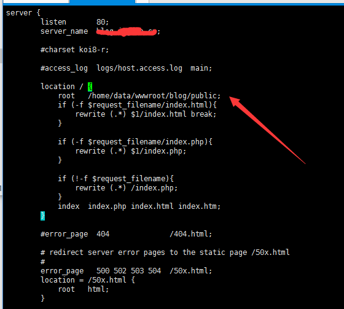
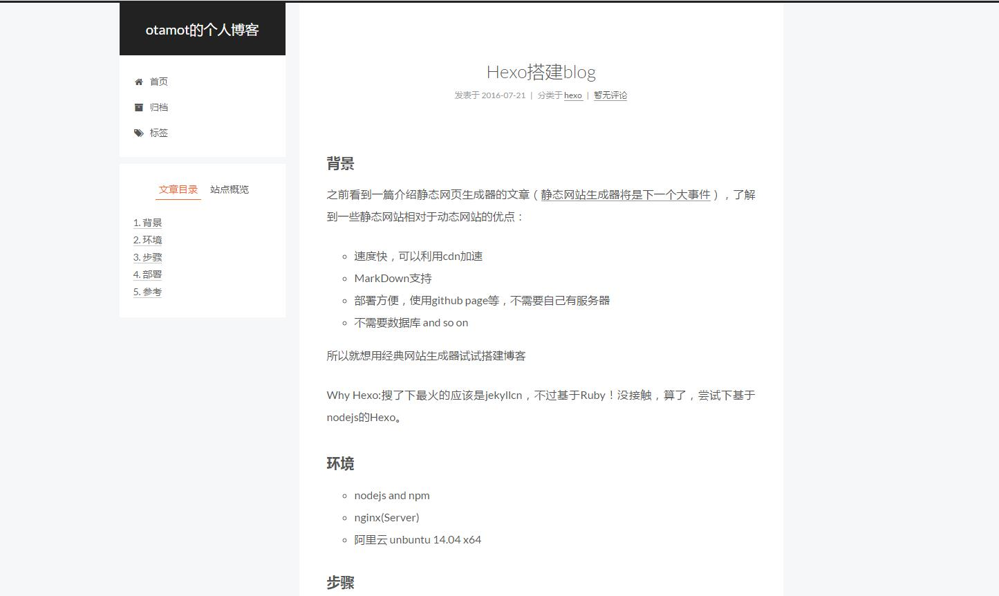

---

title: Hexo搭建blog

date: 2016-07-21 19:54:05

tags: blog

categories: hexo

---


## 背景

之前看到一篇介绍静态网页生成器的文章（[静态网站生成器将是下一个大事件](http://http://blog.jobbole.com/103451/)），了解到一些静态网站相对于动态网站的优点：

- 速度快，可以利用cdn加速

- MarkDown支持，文章可以在本地直接写

- 部署方便，使用github page等，不需要自己有服务器

- 不需要数据库,没有sql就没有伤害

-  and so on


所以就想用经典网站生成器试试搭建博客


Why Hexo:搜了下最火的应该是jekyllcn，不过基于Ruby等环境(我在windows上写，算了)！尝试下基于nodejs的Hexo(js大法好)。

<!-- more -->


## 环境

- nodejs and npm

- nginx(提供web服务，用github pages就不用了)

- 阿里云 unbuntu 14.04 x64


## 步骤


### 1、编译安装nginx

略。。

### 2、使用nvm安装nodejs和npm

略

### 3、安装Hexo

`npm install hexo-cli -g` 安装hexo

`hexo init <folder>` 生成项目文件夹并初始化

`npm install` npm 安装所依赖的包


文件目录结构如下：

```

.

├── _config.yml

├── package.json

├── scaffolds

├── source

|   ├── _drafts

|   └── _posts

└── themes

```


### 配置

1.  站点配置，可修改根目录下的_config.yml文件，配置项可参考[https://hexo.io/docs/configuration.html](https://hexo.io/docs/configuration.html)

2.主题配置，修改主题目录（如themes/landscape）下的_config.yml文件 配置项可参考[NexT主题作者的文档](http://theme-next.iissnan.com/getting-started.html)


### 几个常用命令

- `hexo new [layout] <title>` 新建一篇文章

- `hexo generate`写完文章后可生成（public文件夹下）生成静态文件

- `hexo public [layout] <filename>` 发布

- `hexo server` 开启一个服务器（可在发布到github page前预览下）,打开`localhost:4000`即可查看


## 部署

在运行`hexo generate`后（静态网站已生成）

nginx 配置域名站点，root到public路径下



重启nginx即可访问到生成的站点




如果使用github page，可自己百度hexo github等关键字


## 参考

- [NexT主题文档](http://theme-next.iissnan.com/getting-started.html)

- [在 hexo 中无痛使用本地图片](http://www.tuicool.com/articles/umEBVfI)


