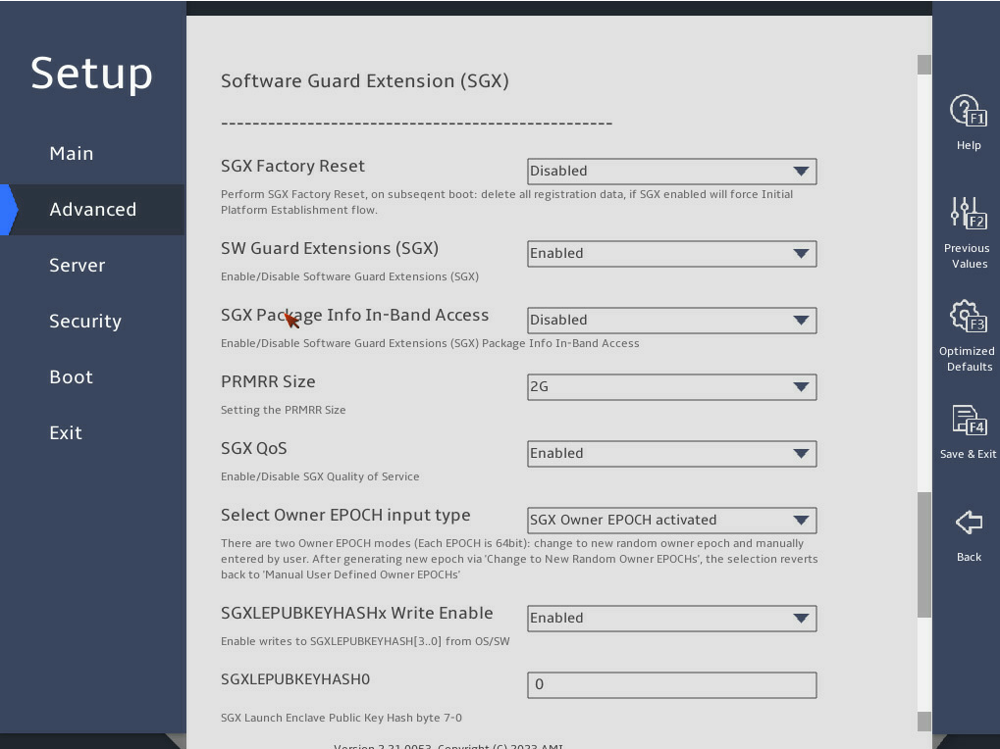

# 1 简介

在数据中心环境内，使用PCCS缓存远程认证所需要的证明材料（Attestation Collateral），如Intel的签名后的PCK 证书链，在运行阶段，就不需要向Intel请求证明材料就可以实现远程认证。

PCCS服支持三种模式，LAZY、REQ、OFFLINE模式。

<!--more-->

**LAZY模式**
LAZY模式为默认模式，PCCS以“按需”的方式运行。只有当客户端应用程序需要生成Quote、验证Quote事请求某个特定的证明材料，并且该材料不在PCCS的本地缓存中，或者缓存已过期，PCCS才会尝试从Intel PCS获取该材料。该模式需要部署阶段可以联网访问PCS，运行阶段可以离线使用。


**REQ模式**
REQ模式与LAZY模式功能相近，区别是不会返回任何数据给调用者，如果没有缓存或缓存过期，还是会向Intel PCS去获取最新的证明材料。该模式同样也需要部署阶段可以联网访问PCS，运行阶段可以离线使用

**OFFLINE模式**
在OFFLINE模式下，PCCS服务不会连接Intel PCS服务。需要通过*PCKIDRetrievalTool*工具在数据中心获取平台信息并导入到PCCS中，再通过*PccsAdminTool*获取平台注册信息。将注册信息下载到有网络的环境中，通过PccsAdminTool请求Intel PCS服务获取证明材料。再将证明材料上传到数据中心，通过PccsAdminTool导入到PCCS服务。该模式合适数据中心部署和运行阶段都不联网的场景。

部署阶段进行联网流程较简单，主要介绍下数据中心完全互联网隔离下OFFLINE模式的使用。

# 2 OFFLINE模式操作

## 2.1 前提条件

1. 数据中心PCCS 已安装并配置
    - 修改 `config/default.json` 中的 `CachingFillMode` 为 `"OFFLINE"`；
    - 配置 `UserTokenHash`（用于平台注册的用户令牌 SHA512）和 `AdminTokenHash`（用于管理操作的管理员令牌 SHA512）。
2. 数据中心已安装PCKIDRetrievalTool
3. 数据中心已安装PccsAdminTool（`pccsadmin.py`）
4. 已在 Intel PCS API 门户申请到 API Key，用于调用 Intel PCS 接口。
5. 联网环境下已安装PccsAdminTool

## 2.2 操作流程


### 2.2.1 【数据中心】PCKIDRetrievalTool获取并提交平台注册信息
使用PCKIDRetrievalTool

```
./PCKIDRetrievalTool \
-f <PCK_ID_FILENAME>.csv \
-url https://<PCCS_SERVER>:<PCCS_PORT> \
-user_token <PCCS_USER_TOKEN> \
-use_secure_cert false
``` 

示例:
```
./PCKIDRetrievalTool \
-f pckid_tee01.csv \
-url https://192.168.3.1:8081 \
-user_token test@10086 \
-use_secure_cert false

```


### 2.2.2【数据中心】从PCCS服务中获取平台列表
使用PccsAdminTool
```
./pccsadmin.py get \
--url https://<PCCS_SERVER>:<PCCS_PORT>/sgx/certification/v4/platforms \
--output_file <PLATFORM_LIST_FILENAME>.json \
--source reg

```

示例:
```
./pccsadmin.py get \
--url https://192.168.3.1:8081/sgx/certification/v4/platforms \
--output_file platform_list.json \
--source reg
```

### 2.2.3【联网环境】获取认证材料
使用PccsAdminTool
```
./pccsadmin.py fetch -u https://api.trustedservices.intel.com/sgx/certification/v4/ \
-i <PLATFORM_LIST_FILENAME>.json \
-o <PLATFORM_COLLATERALS_FILENAME>.json
```

示例:
```
./pccsadmin.py fetch -u https://api.trustedservices.intel.com/sgx/certification/v4/ \
-i platform_list.json \
-o platform_collaterals.json
```

### 2.2.4 【数据中心】导入证明材料
使用PccsAdminTool
```
./pccsadmin put -u https://<PCCS_SERVER>:<PCCS_PORT>/sgx/certification/v4/platformcollateral -i <PLATFORM_COLLATERALS_FILENAME>.json
```

示例:
```
./pccsadmin put -u https://192.168.3.1:8081/sgx/certification/v4/platformcollateral -i platform_collaterals.json

```


## 2.3 问题记录
### 2.3.1 PccsAdminTool pyOpenSSL版本问题
在PccsAdminTool的依赖中，PyOpenSSL版本为>=23.2.0,安装符合这个条件的最新版本会报错
```
asn1>=2.4.1
cryptography>=41.0.7
keyring>=23.0.0
pyOpenSSL>=23.2.0
pypac>=0.14.0
Requests>=2.31.0
setuptools>=65.5.1
urllib3>=1.26.18

```
报错信息为:
```
module 'OpenSSL.crypto' has no attribute 'load_crl
```
可以安装`23.2.0`版本来解决，亦可修改代码
```
pip install pyOpenSSL==23.2.
```

### 2.3.2 获取证明材料Intel PCS返回404问题
**问题描述**

使用PCKIDRetrievalTool获取并提交平台注册信息时，工具提示
```
Warning: platform manifest is not available or current platform is not multi-package platform.
```
从PCCS中获取到的平台列表文件中，platform_manifest也为空，如
```
[{"enc_ppid": "a4a59e6d338c52d9d0f40f50e76edb025a40f1b9f4c2d724d95cb86b1fa1efd515b04c8452dd619d6c2158129b21a1acd95944713f51b277e5945aa1154a7d343f0eeb55b2231859eac2d6d8798603737c934ee896e2870c8627408eb9b63a332a66eaff3f46f062a9e56aae2c955f719dcd5856195888615958344b08702c9f4de3b076ad404d275d51784184d7571f69a39f9c209a8c92e5e3f70b7ff319332a83e106ea0327e63cd501de3ada25ff5c73b4907cb791fa08490b5132f5183ee5448b17e4c8b4627b2c578e306e89365dc140dd6ce4322591c76f8281a8d79d4ea918f46118f5dfa44434d38421bb4df30bd20a1f278384aede5eed82b54ecb67576f6f117f65acde08ebff5cdc8a8df22a10593b0d314c3293b8e5297ee5e6143de0541bc0289e1ae3021c736d247f49d3301812b241d8cf77a57f602ef490f362a96e8718c80125574fec80d48c2388201390852c66bc0bf3bd84251b3aceaa2fba2d9d5fb0d43f916db0abe1701a688e3a82a4298fd1091346aabbac3556", "platform_manifest": "", "qe_id": "07B4EFBCCA44DF633E5937481032CC9A", "pce_id": "0000", "cpu_svn": "09100F0EFAFF00000000000000000000", "pce_svn": "0F00"}]
```
向Intel请求获取证明材料时，返回404。
```
Failed to get PCK certs for platform enc_ppid:****
```

**原因**
BIOS开启SGX功能后,只能使用*PCKRetrievalTool*获取一次平台注册信息，第二次再获取时，就会提示告知`platform manifest`状态不可用，需要重新设置BIOS `SGX Factory reset`为`Enabled`后重启设备才能通过*PCKRetrievalTool*再获取使用。

不同的服务器厂商BIOS设置方法不一致，以下为H3C的服务器BIOS设置方案:
```
Advanced > Socket Configuration > Processor Configuration > “SGX Factory Reset”
```



# 3 参考

- [PCCS](https://github.com/intel/SGXDataCenterAttestationPrimitives/tree/dcap_1.21_reproducible/QuoteGeneration/pccs)
- [PCKRetrievalTool](https://github.com/intel/SGXDataCenterAttestationPrimitives/tree/dcap_1.22_reproducible/tools/PCKRetrievalTool)
- [PccsAdminTool](https://github.com/intel/SGXDataCenterAttestationPrimitives/tree/dcap_1.22_reproducible/tools/PccsAdminTool)
- [Unable to retrieve the collateral from the Intel SGX PCS in offline mode](https://github.com/intel/SGXDataCenterAttestationPrimitives/issues/179)
- [Problem with SGX DCAP Attestation](https://community.intel.com/t5/Intel-Software-Guard-Extensions/Problem-with-SGX-DCAP-Attestation/m-p/1659844)