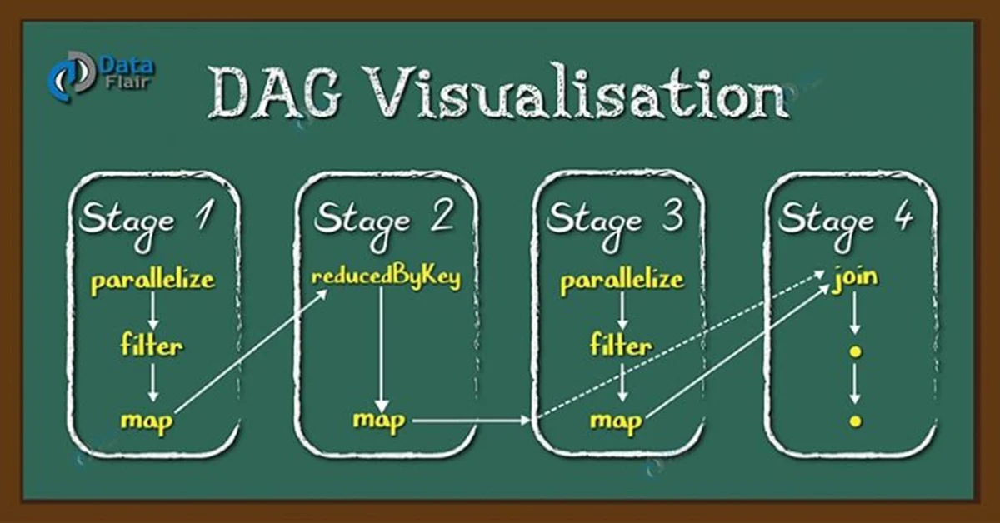
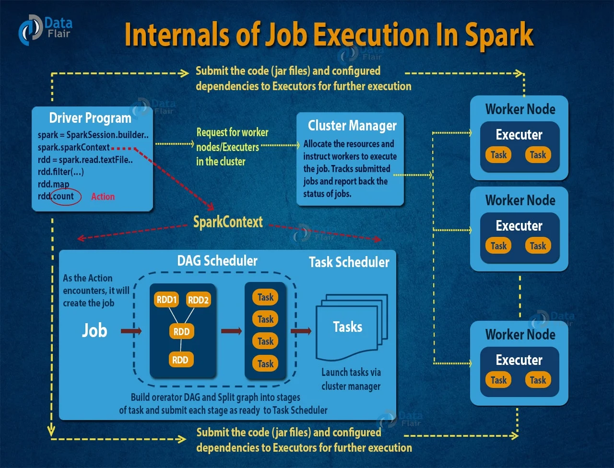

# 什么是DAG
Spark中的有向无环图(Directed Acyclic Graph)是顶点和边的集合，顶点代表RDD，边代表RDD的一系列操作。在Spark DAG中，边代表的操作都是按顺序执行。DAG Scheduler会将DAG图拆分为stage和task。

<!--more-->

# 为什么需要DAG
首先需要介绍`MapReduce`的计算流程:
- 从HDFS读取数据
- 执行`Map`或`Reduce`操作
- 计算结果写回到HDFS中
在计算过程中，所有操作都是独立进行的，Hadoop是不知道下一个阶段会运行什么任务，每次计算完成数据都写回到HDFS。在一些迭代计算中，如果上一个计算任务的数据下一个计算可以直接用，则会造成不必要的HDFS读写。在一些复杂场景，尽管数据量并不大，但是因为每个计算步骤都被上一个计算步骤所阻塞，还是会花费大量的时间。

而Spark通过DAG解决了这些痛点，DAG会提前规划好计算的步骤，调整好执行计划，减少Shuffle数据(数据落盘可跨节点传输)。

# 多级Scheduler
- **`DAG Scheduler`**: 负责“逻辑上”把算子链拆分成多个可以并行执行的Stage，它只关心RDD之间的依赖和Shuffle边界，不管具体的资源分配
- **`Task Scheduler`**: 负责“具体”得将一个Stage拆分成若干个Task，并提交给`Cluster Manager`去执行。`Task Scheduler`要处理任务重试、动态分配Executors、数据本地性等细节。
- **`Cluster Manager`**: 最底层得负责跟集群中的节点打交道，真正去启动/管理Executors进程。常见的集群有`Spark Standalone`、`YARN`、`Mesos`、`Kubernetes`

# DAG工作原理

## 构建逻辑执行图
- 1.**执行逻辑图构建**
	- 解释器在执行transformation算子时，并不会立刻去执行，而是在Driver端通过`SparkSession`(底层是`SparkContext`)来记录一系列算子的调用，也就是所谓的“惰性求值”。这些算子会被串成一条`lineage`链,也就是一个逻辑执行图。此时只是记录了算子之间的依赖关系，尚未划分阶段，也未启动任何计算。
- 2.**Action触发**:
	- 当调用到一个`Action`算子时，`SparkContext`会把之前积累的算子链转换为一个具体的`Job`。在这个`Job`底层会包含一个`RDD`的执行依赖图（`DAG图`）

## DAG Scheduler阶段: 拆分Stage
- 1.**构建物理执行图(Physical DAG)**
	- `DAG Scheduler`会沿着`DAG`图解析，遇到一个宽依赖(`Wide Dependency`)就把之前所有连续的窄依赖(`Narrow Dependency`)收集到一个`Stage`（上游Shuffle结果或者最初的输入数据到下游Shuffle边界中间所有窄依赖算子组成）。
- 2.**生成Task**:
	- 拆分Stage以后，`DAG Scheduler`会根据每个Stage中的分区数，为该Stage生成一组Task，每个Task处理其中的一个分区。
- 3.**调度Stage执行顺序（DAG提交）**
	- `DAG Scheduler` 会维护一个“Stage 依赖图”，先找出所有的潜质依赖的Stage先执行，再按顺序递归提交后续Stage。同时也会将某些已经完成的中间Shuffle结果缓存下来，以便下游Stage拉取。

## Task Scheduler+Cluster Manager: 分配与Task派发
- 1.**Task Scheduler接收来自DAG Scheduler的Task列表**
	-  当`DAG Scheduler`准备好一个可以执行的Stage，就会把该Stage生成一组Task交给Task Scheduler。
- 2.**向`Cluster Manager`请求资源**
	- `Task Scheduler`会向`Cluster Manager`(例如Standalone、YARN、Kubernetes)请求足够的Executor slot(空闲的Executor)用来运行这些Task。
	- 如果是动态扩容，还要先判断是否需要扩容。如果是静态分配，则直接使用预先留好的Executor。
- 3.**`Cluster Manager` 分配资源并启动Executors**
	- `Cluster Manager`负责在集群里的Worker节点上启动相应数量的Executor JVM进程（如果`Cluster Manager`是Kubernetes的话，启动Pod容器，容器内为JVM进程）
	- 每个Executors进程会向Driver注册
	- 同时，Driver（SparkContext）会把必要的依赖(Jar包、Python脚本、Spark配置参数等)下发给对应的Executors。
- 4.**`Task Scheduler` 把具体的Task派发给Executors**
	- 一旦Executor启动并注册完毕,`Task Scheduler`就把对应分区的Task描述分发给可用的Executor。
	- Task在Executor JVM进程中以线程形式运行-每个 Executor对应若干core，每个Task会占用一个core去执行分区逻辑（比如map、filter、reduce等计算）。

## Executor上执行Task: 具体计算与Shuffle
- 1.**本地计算与Shuffle读写**
	- **Task对应窄依赖**:只需要读取本地数据分区(也可能是从数据源中读取),串行执行操作，最终将结果写到内存或磁盘(没有发生跨Executor的数据移动)
	- **Task涉及Shuffle**: 
		- **写阶段(Shuffle Map Task)**: 把处理后的键值对安分区写到写到本地磁盘上(Shuffle文件),并汇报给Driver Shuffle Service或者NM/Livy等管理Shuffle的组件。
		- **读阶段(Shuffle Reduce Task)**: 下游Stage的Task会通过网络从所有对应分区的Shuffle文件拉数据，做聚合/排序等合并操作，发生了跨Executor数据搬移。
- 2.**Task完成后汇报Driver**
	- 每个Task执行完毕后，会把自己的状态和可能产生的Shuffle文件路径通过RPC汇报给Driver上的`Task Scheduler`
	- 如果是成功，Driver会更新Shuffle文件元数据;如果失败，Driver会决定是否重新重试Task（默认重试4次），或者直接让整个Job失败。
- 3.**Stage完成&提交下一个Stage**
	- 当某个Stage下的所有Task都执行完(Shuffle文件已经准备好)，它就被标记为“已完成”
	- `DAG Scheduler`会检查是否还有下游Stage依赖该结果，如果有，就开始为下一个Stage分配Task。如果是最后一个Stage，则执行Action逻辑(比如写入外部存储)，Job结束。

# DAG的优点再总结
Spark通过DAG来表示和调度任务，主要有减少数据IO与传输、提高执行效率和资源利用、容错等优点：
-  **延迟构建执行计划**: transformation算子不会立马执行，而只会形成逻辑依赖图，只有遇到action操作是，才会触发真正的计算，提高了整体执行的效率。
- **算子融合(Stage)**:通过区分宽依赖(`Wide Dependency`)和窄依赖(`Narrow Dependency`)来划分Stage，减少不必要的shuffle。如`rdd.map(...).filter(...).map(...)`，这三个操作都不会触发shuffle，则会包含在一个stage中，形成窄依赖，也就是同一个分区内的数据的所有操作都在同一个JVM线程里“串联”完成，中间不需要往磁盘中写，也不用在executor之间传输数据。
- **全局算子重写与剪裁**:在Spark SQL/DataFrame场景中，DAG在逻辑计划上还会经过Catalyst Optimizer。通过DAG，Spark能将所有算子和条件一次性拿到，做列裁剪、谓语下推、子查询消除等优化。
- **选择最优物理执行策略**: 通过DAG，Spark不仅知道算子链，还能统计各个算子输出的大致行数、分区数等信息，进一步生成物理计划。在物理计划阶段，Spark会选择合适的Shuffle方式(Sort-based Shuffle、Tungsten Shuffle)、join算子实现(Broadcast Hash Join、Sort-Merge Join)、数据倾斜优化策略等，从整体来看保证资源利用率更好，执行路径更优点。
- **容错**: DAG保留了完整的RDD依赖关系，Task执行失败或者某个分区丢失时，只需要沿着依赖树回溯到最原始的数据分区，重新计算该分区所需要的所有的Transformation，而不用计算整个Job。
- **灵活调度与资源利用**: Spark可以把多个互相独立的Stage同时提交给Task Scheduler。当一个Stage的某些Task在等待Shuffle数据时，Scheduler可以先把其他独立Stage的Task派出去，不会造成集群资源的空闲。
# 参考
- https://waltyou.github.io/Spark-DAG/
- https://data-flair.training/blogs/dag-in-apache-spark/
- 《大数据处理框架Apache Spark设计与实现》

