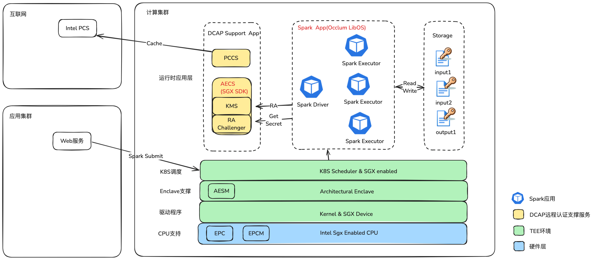
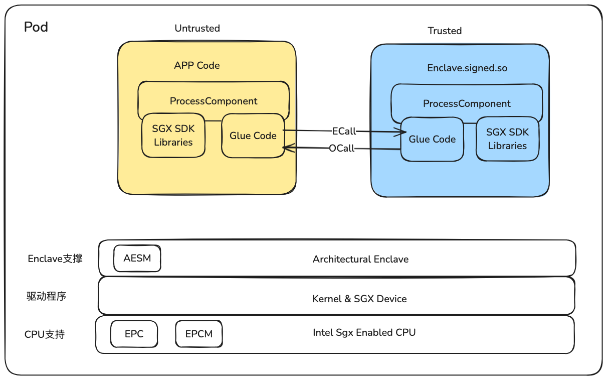
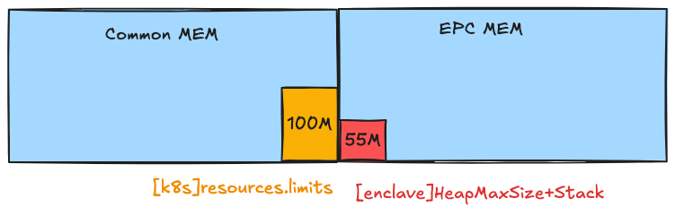
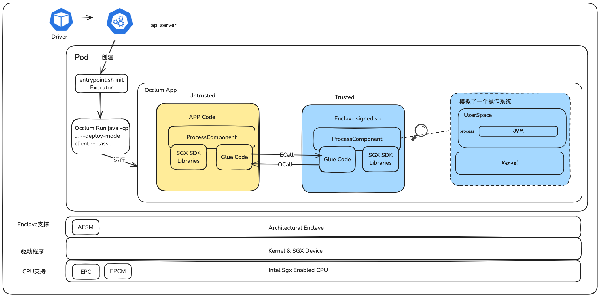
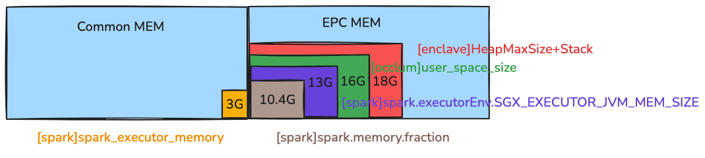
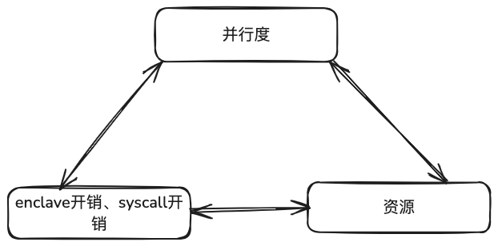

# 背景
生产要素是指在生产活动中所必需投入的各种资源或条件，用于创造产品或提供服务。
在数字经济时代，数据正从“潜在的资源”演变为“核心生产要素”。

随着信息技术的发展和产业应用的演化，数据要素投入生产的途径可分为三次价值释放过程，即数据支撑业务贯通、数据推动数智决策、数据流通对外赋能。在数据流通对外赋能阶段，数据不仅在企业内部流转,也将会通过流通发挥更大价值,实现多方共赢，但在实现数据价值的过程中，我们也面临诸多挑战。如主体责任不清、利益诉求不一致、能力参差不齐、责任链路能不清，数据方数据流通往往丢失控制权和出现安全问题。

针对这些痛点，我们提出了多层次解决方案：通过主体准入审核、法律法规保障和事后审计建立制度保障；同时利用**隐私计算**、数据空间等技术建立技术信任和数据管控。

<!-- more -->

## 隐私计算的几种实现路径
主要分为MPC、联邦学习、TEE，每种技术的实现路径优缺点见(隐私计算技术路线介绍及对比)[https://www.yuque.com/secret-flow/admin/exgixt72drdvdsy3]。其中TEE技术具有大规模计算、性能损失小、可以离线运行等优势，适用于安全大数据运算。

# 总体方案
基于Intel SGX技术构建Spark实现大数据计算和机器学习的方案，支持数据保护、安全计算。

# 内存模型
## SGX-SDK开发应用

## Occlum开发应用

# Spark On TEE调优
## TEE特性
- TEE内部的内存通常是加密的，频繁的读写内存进行数据处理、shuffle、缓存等操作都会增加CPU的负担

- TEE环境为了安全隔离，对系统调用进行了严格限制和控制。尽可能内部处理系统调用，减少穿透TEE边界的次数。
- 网络I/O是不安全的

## 误区
- 运行配置越高，性能越好

## 调优方式

- 优化内存
    - 优化数据结构、Kryo序列化
    - 设置合适的内存，避免浪费
- 减少Syscall
    - 优化应用程序逻辑，复用RDD，如避免重复从S3上读取数据创建RDD
    - 减少Shuffle操作：优化数据分区策略、使用广播变量等方式来减少数据在网络上的传输
    - 尽可能得使用内存缓存，减少对磁盘I/O的依赖
合并分区选择coalesce而不是repartition(没有特殊要求的情况)
- 其他
    - [安全]shuffle数据不要解密为明文，不管executor之间是否有TLS
    - 依赖系统监控与Spark-UI来分析与调优

