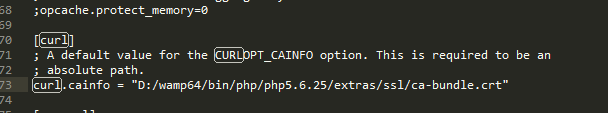
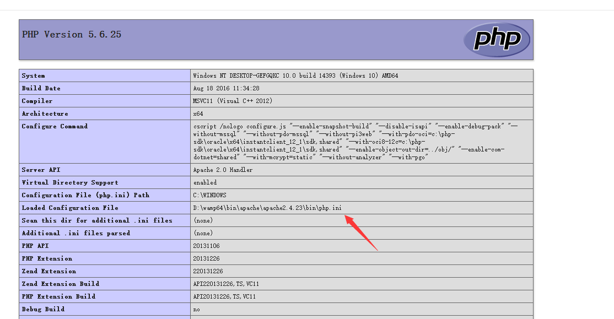

---

title: cURL error 60 SSL certificate problem

date: 2016-11-29 12:08:10

tags:
	- PHP
	- 错误

categories: php

---

## 问题

开发微信相关功能时，使用curl去调用微信的接口（https)时，发生`cURL error 60: SSL certificate: unable to get local issuer certificate.`的错误。

## 环境

windows  wamp环境  laravel  使用easy-wechat

## 分析

由于微信使用https协议，wamp使用的php没有使用证书，通过查询，得知添加证书即可解决问题。
<!-- more -->

## 解决

### 下载证书

访问 [ca-bundle](https://github.com/bagder/ca-bundle/tree/e9175fec5d0c4d42de24ed6d84a06d504d5e5a09 "证书地址")，通过zip下载(提示文件损坏-.-)或者git clone下载到本地，将项目内的`ca-bundle.crt`文件放到php_dir\extras\ssl\下（位置随意）

### 修改php.ini
打开curl.cainfo注释，填写正确的crt文件位置，打开open_ssl扩展

#### 小插曲
首先要找到正确的php.ini，可能Apache加载的不是你php目录下的php.ini,wamp环境下，默认加载的可能是apache/bin/php.ini，最好打开phpinfo()看下加载的php.ini位置

### 重启Apache

