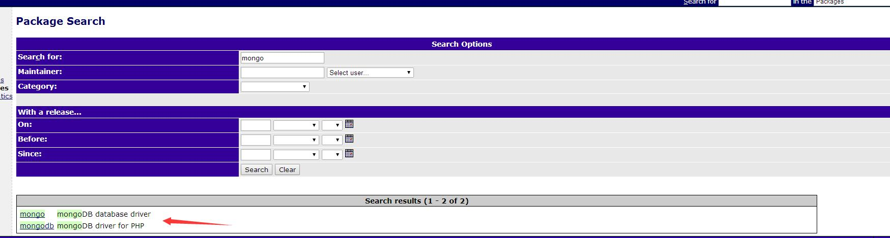
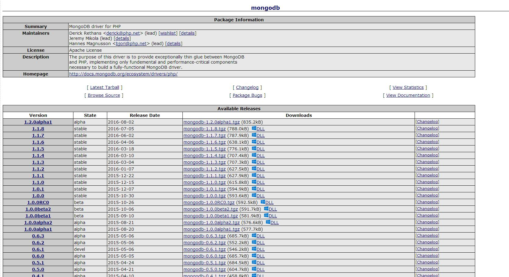
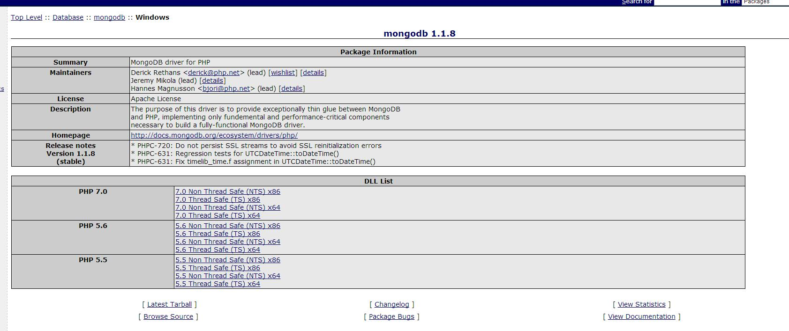
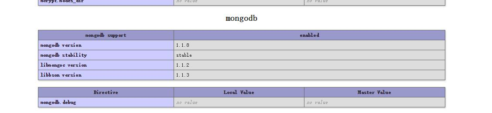

---

title: php7安装mongodb扩展（windows）

date: 2016-07-21 19:54:05

tags: 
	- PHP
	- mongodb扩展

categories: hexo

---

## 从PECL下载扩展

### 1.什么是PECL

PECL(PHP Extension Community Library)是一个php扩展仓库，提供已知扩展的目录及下载和开发扩展php扩展的工具。

### 2.PECL 与PEAR的区别

PEAR（PHP Extensions and Application Repository）PHP扩展与应用仓库，PEAR里的代码基本都是由PHP代码编写，PEAL的代码由C语言开发.打个比方，PEAR提供了一个由php编写的使用ftp的类库，拿过来就可以直接用了，PECL提供dll之类的扩展（windows上）。PEAL是php应用层面的，PECL是php底层扩展。
<!-- more -->

### 3.下载扩展

从[PECL的官网](http://pecl.php.net/)搜索mongo，结果页如下

我们选择mongodb(mongo已经不维护了),进入详情页，如下
，可以看到这个扩展的摘要、维护者、license等信息，从最新的稳定版下载（此处为1.1.8，windows选择DLL），进入具体下载页面，如图：
，选择php7.0的Thread safe X64版本下载（根据环境的具体版本）

## 安装扩展

将下载后的文件解压，将php_mongodb.dll复制到php的ext文件夹中，修改php使用的php.ini（我使用的是wamp）,添加extension=extension=php_mongodb.dll,重启Apache后，phpinfo()函数打印出的信息中便可看到
,到此，扩展安装成功！

