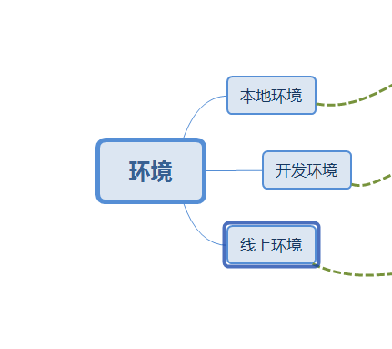
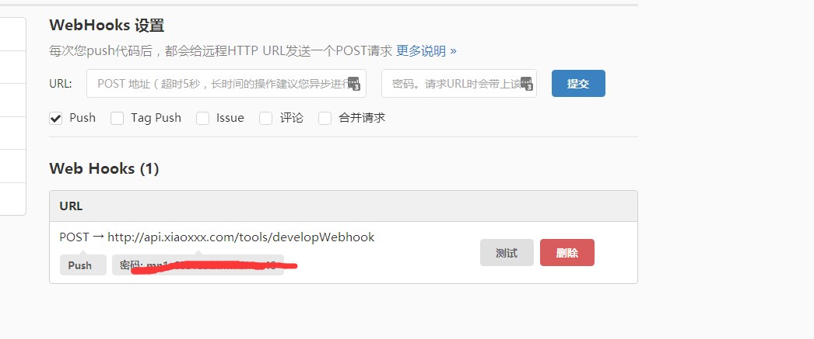
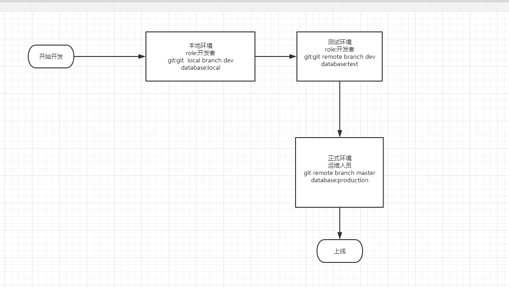

---

title: php代码环境及开发部署流程介绍

date: 2016-12-5 17:47:01

tags:
	- PHP
	- wamp
	- git

categories: php

---

##摘要
介绍小仙目前的三种代码环境、以`m.xiaoxxx.com`为例

## 三种环境

1. 本地环境（可不使用）
2. 测试环境
3. 线上环境

<!-- more -->

### 本地环境

#### 本地开发步骤

1. 使用wamp软件,开启Apache、mysql、php环境

2. 进入www目录，从远程代码仓库获取代码,获取branch为 dev（dev分支用于测试，master分支用于线上版本）,  ，`gitclonegit@git.oschina.net:hzxiaoxxx/m.xiaoxxx.com.git -b `,

3. 配置好虚拟主机，重启apache

4. 开发完毕后，commit到本地dev分支，最后push到远程的dev分支

#### 本地环境中前后端合作的几个问题

1. 前端机子上有前端的代码（本地的git仓库）,后端机子上也有前端的代码仓库，怎么进行合作呢？
利用远程仓库，假设前端已经写好页面，commit到本地仓库，再push到远程仓库，后端进行pull拉取操作，从远程仓库讲前端的代码拉倒本地，遍可以看到前端的修改

2. 假如前后端分离,前端负责什么，后端负责什么？
	- 后端负责规定路由（以及控制器层面页面需要放在哪个文件（比如登录页面，需要放在哪个模板文件），并且写好功能接口
	- 前端负责将页面的html放到具体模板文件（如果涉及到复杂模板，如继承或者同步数据多的情况，最好由后端完成），将css、js等文件放到正确位置，laravel为public下，最好添加文件夹(activity\oneactivity)，将css、js文件放到该文件夹下（避免与其他项目冲突），或者放到oss上，最后修改模板文件上的css、js地址
3. 测试有远程的dev分支，前端和后端都是通过远程分支来合作完成项目，可以不用本地环境，直接使用测试环境吗？
	能！可以不使用本地环境，前端直接将远程仓库的dev分支拉倒本地，修改完push上去，访问`test.m.xiaoxxx.com` ,后端也直接pull远程的dev分支，修改完push上去，通过同一地址可以看到修改效果

### 测试环境

测试环境部署在测试服务器，主要目的是为前后端整合后测试，或修改bug后测试（完成本地编码后）

#### 实现

通过git远程仓库（之前的gitlab、现在的码云）提供的webHooks功能，当收到一些本地客户端对远程仓库的请求时，如Push、Tag Push 、Issue时，远程仓库会发送请求到我们自己的服务器，提供这次事件相关的数据（如 branch、提交者等信息）,我们收到请求后，将代码拉取下去

完成后访问`test.m.xiaoxxx.com`即可访问新的代码了-。-

### 线上环境

当完成测试后，负责上线的人员需要将远程仓库中的dev合并回master（之前master还停留在你修改之前的节点），在服务器上使用[deploy](https://github.com/deployphp/deployer "deploy")到线上环境。

## 部署流程

