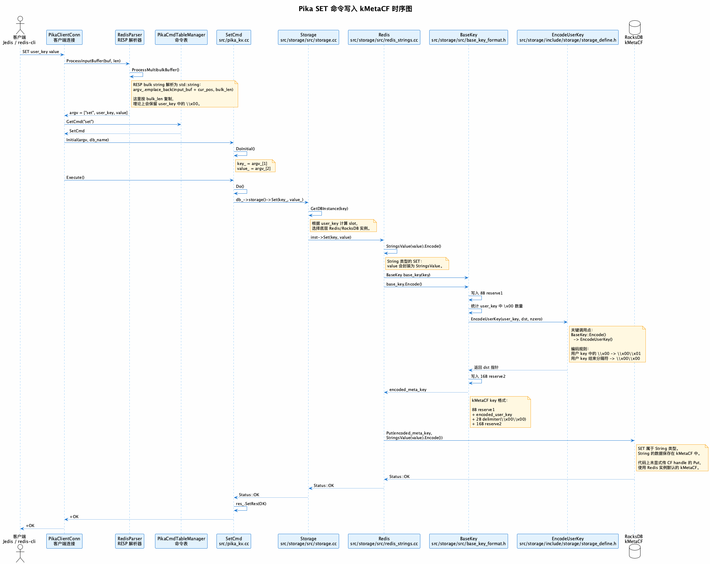
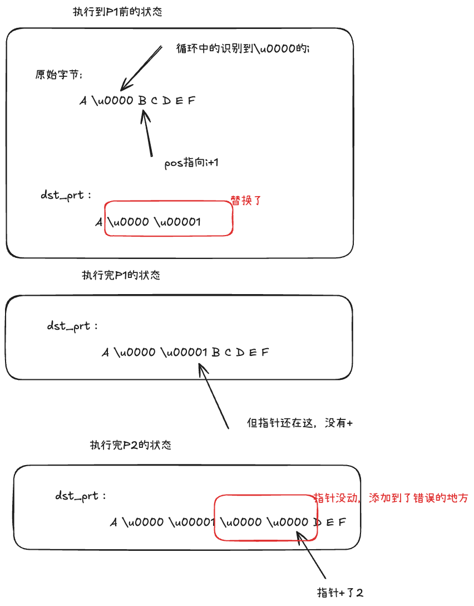

# 背景
项目上需要用到pnSha256->pnMd5的转换关系，因此在pika中使用String存储彩虹表映射关系，key为pnSha256，value为PnMd5。
**为了节省存储，因此不想为sha256散列后的字节数组做hex编码，直接使用字节数组作为user_key**。
不考虑pika层面对user_key的编码处理，仅从是否hex编码上，预期就能节省存储为:
```
(18000000000-13000000000)*32/1024/1024/1024 = 149G
```

<!-- more -->

> SHA256的原始结果固定时32字节，hex编码后变为64字节。

>为区别pika中的存储key，java层面用户set的key以下称为user_key,pika CF中存储的key为storage_key

但使用set方法调用pika存储后，再使用get方法调用pika，查询不到结果。

```java
@Test  
/**  
 * key乱码查询不到的手机号  
 */  
public void errorPn(){  
    System.setProperty("zkHost","{zkHost}");  
    long init = 13000000000L;  
    byte[] value = "test".getBytes(StandardCharsets.UTF_8);  
    while (true) {  
        byte[] key = getSha256(String.valueOf(init));  
  
        RedisUtil.of("{pikaClusterName}").set(key, value);  
        byte[] result = RedisUtil.of("{pikaClusterName}").get(key);  
        if (result == null || result.length == 0) {  
            break;  
        }  
        init++;  
    }  
  
    System.out.println("error pn=" + init);  
}

// 
```
最后输出结果为`error pn=13000000001`,也就是有很多pnSha256，set后，get不出value。


# 错误可能性及分析

**写进去没有?**
在开发环境flushdb、compact后，尝试写入`13000000358`的散列字节数组，使用`keys *`命令会发现有一条user_key，但key的名称不对，为`461-`。`461-`是公司库的分布式方案的分片号前缀，预期应该后面还有一些乱码字符。能看出来数据写进入，但user_key不对。

**是公司封装库的问题?**
排除方式
- 封装库源码查看:
	- 排除: 源码内未对user_key进行处理，只是增加了从zk中获取slot路由信息，再使用对应的pika实例
- 不用封装库，直接使用Jedis库或socket连接
	- 排除:同样存在相同问题
- pika服务的问题，大概率

使用Jedis和socket测试代码：
```java
@Test  
/**  
 * 直连 Pika 验证二进制 key，绕过 RedisUtil、DB 前缀和分片路由。  
 */  
public void directPikaBinaryKeySetGet() throws IOException {  
    long phone = 13000000001L;  
    byte[] sha256Key = getSha256(String.valueOf(phone));  
    byte[] value = "1234".getBytes(StandardCharsets.UTF_8);  
    byte[] asciiKey = ("direct-pika-ascii-key-test:" + phone).getBytes(StandardCharsets.UTF_8);  
  
    System.out.println("phone=" + phone);  
    System.out.println("sha256 key: " + describe(sha256Key));  
    System.out.println("first zero index=" + firstZeroIndexBeforeTail(sha256Key));  
  
    try (Jedis jedis = new Jedis("192.168.12.221", 9221, 3000)) {  
        System.out.println("pika ping=" + jedis.ping());  
        jedis.del(asciiKey, sha256Key);  
  
        jedis.set(asciiKey, value);  
        byte[] asciiResult = jedis.get(asciiKey);  
        System.out.println("jedis ascii get: " + describe(asciiResult));  
        Assert.assertArrayEquals(value, asciiResult);  
  
        jedis.set(sha256Key, value);  
        byte[] binaryResult = jedis.get(sha256Key);  
        System.out.println("jedis sha256 raw get: " + describe(binaryResult));  
  
        jedis.del(asciiKey, sha256Key);  
    }  
  
    byte[] rawRespResult = directPikaBinaryKeySetGetByRawResp(asciiKey, sha256Key, value);  
    System.out.println("raw resp sha256 raw get: " + describe(rawRespResult));  
    Assert.assertArrayEquals("Pika direct binary key set/get failed. See hex output above.", value, rawRespResult);  
}  
  
private byte[] directPikaBinaryKeySetGetByRawResp(byte[] asciiKey, byte[] binaryKey, byte[] value) throws IOException {  
    try (Socket socket = new Socket("192.168.12.221", 9221)) {  
        socket.setSoTimeout(3000);  
        InputStream input = socket.getInputStream();  
        OutputStream output = socket.getOutputStream();  
  
        System.out.println("raw resp ping=" + sendRespCommand(input, output, bytes("PING")).asText());  
        sendRespCommand(input, output, bytes("DEL"), asciiKey, binaryKey);  
  
        sendRespCommand(input, output, bytes("SET"), asciiKey, value);  
        RespReply asciiGet = sendRespCommand(input, output, bytes("GET"), asciiKey);  
        System.out.println("raw resp ascii get: " + describe(asciiGet.data));  
        Assert.assertArrayEquals(value, asciiGet.data);  
  
        sendRespCommand(input, output, bytes("SET"), binaryKey, value);  
        RespReply binaryGet = sendRespCommand(input, output, bytes("GET"), binaryKey);  
        sendRespCommand(input, output, bytes("DEL"), asciiKey, binaryKey);  
        return binaryGet.data;  
    }  
}  
  
private RespReply sendRespCommand(InputStream input, OutputStream output, byte[]... args) throws IOException {  
    output.write(("*" + args.length + "\r\n").getBytes(StandardCharsets.US_ASCII));  
    for (byte[] arg : args) {  
        output.write(("$" + arg.length + "\r\n").getBytes(StandardCharsets.US_ASCII));  
        output.write(arg);  
        output.write("\r\n".getBytes(StandardCharsets.US_ASCII));  
    }  
    output.flush();  
    return readRespReply(input);  
}
```
结果为:
```
phone=13000000001
sha256 key: len=32, hex=69f30fe7cc5719c50a898e20c1410c87560b0bdac75986003cf98f0a45ea184f
first zero index=23
pika ping=PONG
jedis ascii get: len=4, hex=31323334
jedis sha256 raw get: null
raw resp ping=PONG
raw resp ascii get: len=4, hex=31323334
raw resp sha256 raw get: null
```

# 源码分析

## CF列族中的存储格式
在pika中String类型的物理存储在rocksdb的kMetaCF列族中，storage_key的格式为
```
reserve1(8B) + escaped user key + \x00\x00(2B) + reserve2(8B)
```
其中`\x00\x00`两个字节是作为分割符存在,user_key会被编码后再存入，编码的内容也就是把user_key中的`\x00`(也就是\u0000)字节转换为`\u0000\u0001`，特别是针对以下两种情况:
- user_key中有 `\x00\x00` ，如不被编码，会被误认为分隔符
- user_key末尾有 `\x00` ,若不被编码，加上分隔符后为`a b c \x00 \x00 \x00`,则可能丢失掉末尾的\x00,只拿到 `a b c`

一个正确的带有 `\x00` user_key的编码示例
```
# user_key
A B C D \u0000  E F G

# escaped user key
A B C D \u0000 \U0001 E F G
```

## set流程


重点就是`src/storage/include/storage/storage_define.h`文件内的`EncodeUserKey`方法


## EncodeUserKey
v4.0.1版本中的代码为
```c
const static char kNeedTransformCharacter = '\u0000';
const static char* kEncodedTransformCharacter = "\u0000\u0001";
const static char* kEncodedKeyDelim = "\u0000\u0000";
const static int kEncodedKeyDelimSize = 2;

inline char* EncodeUserKey(const Slice& user_key, char* dst_ptr, size_t nzero) {
  // no \u0000 exists in user_key, memcopy user_key directly.
  if (nzero == 0) {
    memcpy(dst_ptr, user_key.data(), user_key.size());
    dst_ptr += user_key.size();
    memcpy(dst_ptr, kEncodedKeyDelim, 2);
    dst_ptr += 2;
    return dst_ptr;
  }

  // \u0000 exists in user_key, iterate and replace.
  size_t pos = 0;
  const char* user_data = user_key.data();
  for (size_t i = 0; i < user_key.size(); i++) {
    if (user_data[i] == kNeedTransformCharacter) {
      size_t sub_len = i - pos;
      if (sub_len != 0) {
        memcpy(dst_ptr, user_data + pos, sub_len);
        dst_ptr += sub_len;
      }
      memcpy(dst_ptr, kEncodedTransformCharacter, 2);
      dst_ptr += 2;
      pos = i + 1;
    }
  }
  // P1: 最后一个/u0000的位置，要把/u0000后的字节全部拷贝写入dst_ptr
  if (pos != user_key.size()) {
    memcpy(dst_ptr, user_data + pos, user_key.size() - pos);
  }

  // P2: 拼接分隔符 
  memcpy(dst_ptr, kEncodedKeyDelim, 2);
  dst_ptr += 2;
  return dst_ptr;
}
```
代码逻辑为如果有`\u0000`,则进行替换为`\u0000\u0001`,最后返回dst_ptr(最终的key指针)，用于继续拼接其他字节。

**但该代码有问题**:  如果走到了P1判断里，也就是说`\u0000` 不在user_key的末尾的话，在字节数组的中间的话，就会把pos位置数据复制到dst_prt上后，但dst_prt指针没有移动，本应该要移动(`user_key.size() - post`),会导致拼接分隔符继续在pos位置后添加分隔符，覆盖了pos后的数据。

> 这样也能解释的通手机号`13000000358`写入后`keys *`出现`461-`，因为该号码散列后的字节数组，第一个字节就是\u0000,编码后为`***(461-对应的字节) \u0000 \u0001 \u0000 \u0000(分隔符) ****(散列后其他的字节)`，keys命令去获取key时，只拿了分隔符之前的字节还原为key

用一张图来说明:

# 其他疑问
## get为什么获取不到
**set 编码后的key是错误的，get时采用同样编码得到同样错误的key，应该能查到才对？**
BaseKey的数据结构为:
```
  class BaseKey {
   private:
    char* start_ = nullptr;
    char space_[200];        // 这里没有初始化
    char reserve1_[8] = {0};
    Slice key_;
    char reserve2_[16] = {0};
  };
  
```
其中 `space_` 数组是用来存储200个字符以下的key的，他是没有初始化为0的。造成读取不到的问题有两个:
- 1.set和get是两个独立的栈，拿到的`space_`的初始内存就不一样
- 2.EncodeUserKey() 实际写入时，尾部 memcpy 后没有移动 dst_ptr，导致实际写入长度小于 needed，但 BaseKey::Encode() 还是按 needed 返回
因此构造的两次key就不一样，以下为示例:
```
原user_key:  A B \u0000 \u0000 C D
正确应该是： reserve1 + A B \u0000 \u0001 C D \u00000 \u00001 + reserve2 
实际变成： reserve1 + A B \u0000 \u0001 \u0000 \u0000 reserve2 + 未写入字节...(少了两个，这两个会是是不确定的)
```

> anyway，就算能读到也有问题


# 解决方案
## PR修复问题
```
  if (pos != user_key.size()) {
    size_t tail_len = user_key.size() - pos;
    memcpy(dst_ptr, user_data + pos, tail_len);
    dst_ptr += tail_len;
  }
```

修复后，使用字节数组为key的方案，存储会减少，可读性变差


## 使用hex编码
避免出现`\x00`的问题，且DBA排查方便，但存储会变大


