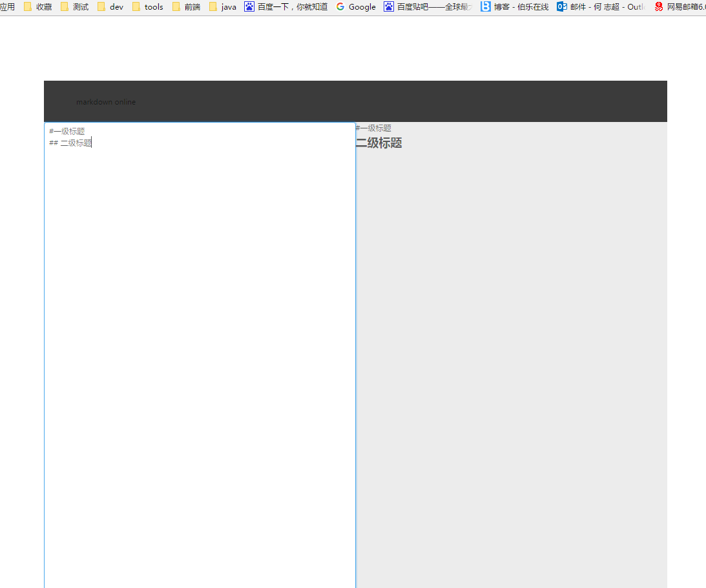
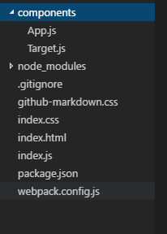
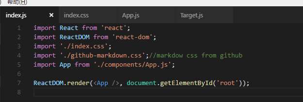
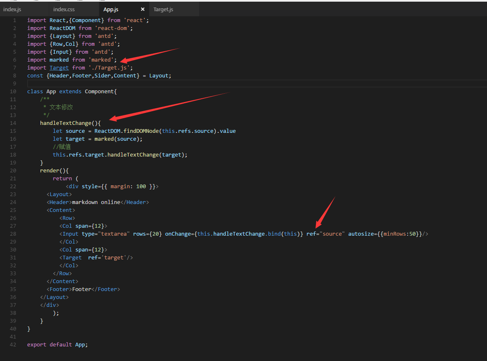
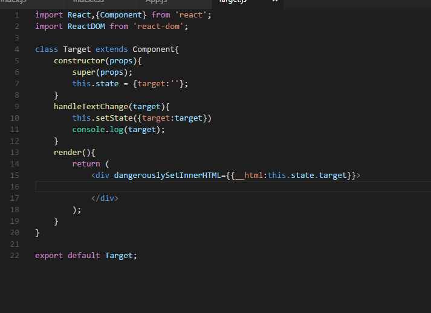

---

title: React编写简易markdown页面

date: 2017-01-24 13:36:31

tags:
	- React
    - makrdown
    - ANT DESIGN

categories: React

---

## prepare
nodejs+npm
## 简介

基于[ANT DESIGN](https://ant.design/index-cn "ANT DESIGN")搭建，markdown转换库使用[marked](https://www.npmjs.com/package/marked),最终效果
，左侧为输入款，右侧为预览框

<!-- more -->

## 步骤

### 初始化项目
全局安装antd
`$ npm install antd-init -g`
使用antd生成项目
`
$ mkdir antd-demo && cd antd-demo
`
`$ antd-init`
成功之后会生成

webpack.config.js是webpack的配置文件，index.js是entry文件

### 编写index.js

主要是引入react相关，css等，渲染App组件到id为root的div

### 编写App.js、Target.js组件

App.js渲染页面布局以及渲染了左侧输入框，并监听输入框内的内容修改(handleTextChange)，获取并转化内容为markdown格式的文本，调用右侧组件(Target)方法修改Target的state

Target组件为markdown显示组件，并提供handleTextChange给父级组件App修改其state，达到重新渲染组件的效果

