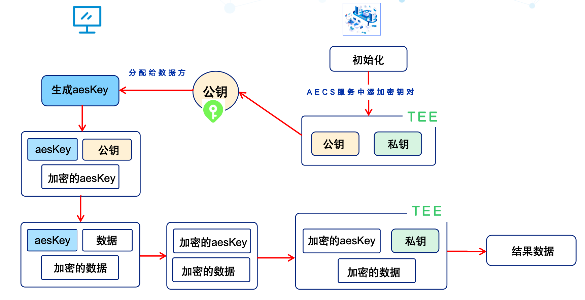

# 0.介绍

## 0.1 AECS介绍
[AECS](https://github.com/SOFAEnclave/enclave-configuration-service) 全称为 Attestation based Enclave Configuration Service,AECS为TEE应用提供密钥生成、管理、存储与分发服务。TEE应用在与AECS进行双向认证后，就可以获得AECS服务中的密钥用于后续业务。
<!-- more -->

### 0.1.1 支持密钥
AECS支持以下类型密钥:
- AES-GCM256 key
- RSA key pair
- SM2 key pair
- Self-signed certificate and key
- Secret imported by user(Bring your own secret)
- Application sensitive configurations as key-value pair

### 0.1.2 特性
AECS服务主要特性如下:
- 内存安全: 同样运行在TEE环境enclave中，运行时内存不可见
- 拥有远程RA的能力: 能对TEE应用提供远程认证，结合Occlum的init-ra流程，能解耦业务无关的认证和获取密钥流程，让开发者专注于业务功能开发
- KMS功能:支持多种类型密钥，能保护运行时和存储态密钥的安全。

### 0.1.3 用途
机密计算TEE方案相较于其他隐私计算技术（MPC、联邦学习）具备大规模数据运算、性能损失小、现在算法或程序方便改造等优点，但同时也有需要专门的硬件支持（支持TEE技术的）、数据需要汇聚计算等缺点，特别是多方数据需要（出保护区）汇聚计算，需要做到额外的安全加固，才能保证数据在TEE环境的安全。比如以下几点:
- 数据加密，保障传输与存储的安全
- 数据要在可信的TEE程序中被使用：数据在可信的TEE程序中安全的加解密处理、不被泄漏到TEE环境外。不可信的程序无法获取到原始数据、密钥等隐私数据。

应对这样的需求，AECS提供了一个很好的解决方案:
- 本身作为一个TEE的KMS服务，能安全地提供密钥服务
- 提供远程RA的功能（根据度量值等心思），能够对信任的TEE程序分发密钥



## 0.2 开源AECS项目介绍
开源的版本实现了核心功能，但以下几个点略有欠缺:
- 测试体验为主，相关脚本都是运行SIM模式，不需要在SGX硬件上就可以运行，但是没有实际运行在Intel SGX应用上的构建流程
- 运行模式为Debug模式，没有PreRelease或者Release相关的配置或者打包说明，依赖开发者拥有比较强的SGX开发经验
- 密钥持久化存储没有分布式方案，只有local磁盘，虽然可以使用NFS等技术，但从密钥管理的角度，能支持S3等存储就更好了（当然可以自己实现）

故针对需要在实际Intel SGX硬件环境下运行的AECS，进行如下修改和构建。


# 1.环境准备

## 1.1 下载源码
下载Release v2.0.0的开源代码

```
 git clone -b v2.0.0 https://github.com/SOFAEnclave/enclave-configuration-service
```

## 1.2 安装依赖
```
git submodule update --init --recursive
```
项目主要依赖
- gflags: 处理程序命令行参数
- unified_attestation: 远程认证统一框架
- yaml-cpp: 解析yaml

## 1.3 Docker安装
程序在docker容器中打包，通过挂载的方式，将c++编译结果文件保存在宿主机上。运行时也为docker容器，需要制作Docker镜像,所以需要在宿主机内安装Docker。

## 1.4 SGX驱动
在支持Intel SGX的设备上安装SGX驱动，确认存在`/dev/sgx`、`/dev/sgx-enclave`、`/dev/sgx_provision`文件

## 1.5 DACP相关服务
确保安装好AESMD和PCCS等DACP支持服务


# 2.构建过程

## 2.1 编译

### 2.1.1 [配置]修改./deployment/dockerbuild.sh
```
sudo docker run -t --rm \
    --privileged \
    --name $CONTAINERNAME \
    --net=host \
    -v $BUILDDIR:/root/$REPONAME \
    -w /root/$REPONAME \
    --cap-add=SYS_PTRACE \
    --security-opt seccomp=unconfined \
    $IMAGE \
    bash -c "./build.sh --mode SIM --build Debug $BUILDOPT" || exit 1
```
去除 --mode SIM，修改后的命令为
```
sudo docker run -t --rm \
    --privileged \
    --name $CONTAINERNAME \
    --net=host \
    -v $BUILDDIR:/root/$REPONAME \
    --device=/dev/sgx/enclave \
	--device=/dev/sgx/provision \
    -v /dev/sgx:/dev/sgx \
    -w /root/$REPONAME \
    --cap-add=SYS_PTRACE \
    --security-opt seccomp=unconfined \
    $IMAGE \
    bash -c "./build.sh  --build Debug $BUILDOPT" || exit 1
```

--build参数支持三个选项，为Debug|PreRelease|Release
- Release模式使用两步签名法，保障签名私钥的安全
- 三个模式对应的配置在./third_party/unified_attestation/ual/enclave/config/enclave.config.{BUILD_MODE}.xml中，可以设置堆栈大小、线程数、是否支持Debug模式等，有一定并发的需要可以调大堆栈大小、数据库大小

### 2.1.2 [配置]修改修改enclave配置
需要根据实际的应用需要内存、并发线程数修改对应的配置
enclave.config.{BUILD_MODE}.xml示例如下

```
<EnclaveConfiguration>
  <ProdID>1</ProdID>
  <ISVSVN>1</ISVSVN>
  <StackMaxSize>0x40000</StackMaxSize>
  <HeapMaxSize>0x20000000</HeapMaxSize>
  <TCSNum>16</TCSNum>
  <TCSPolicy>1</TCSPolicy>
  <!-- Recommend changing 'DisableDebug' to 1 to make the enclave undebuggable for enclave release -->
  <DisableDebug>1</DisableDebug>
  <MiscSelect>0</MiscSelect>
  <MiscMask>0xFFFFFFFF</MiscMask>
</EnclaveConfiguration>
```

### 2.1.3 [执行]编译代码
```
./deployment/dockerbuild.sh
```

> 打包下载系统依赖类库curl、grpc、openssl过慢时，可以挂代理，或者其他环境下载好tar.gz包放到./toos/deps/下

编译成功后，项目跟目录会有build/out/文件夹，里面包含签名好的enclave程序`aecs_enclave.signed.so`

## 2.2 制作Docker镜像

### 2.2.1 [执行]创建镜像和相关配置
```
./deployment/generate_certs_and_kubeconfig.sh
```

### 2.2.2 [配置]添加sgx_default_qcnl.conf

在./deployment/aecs_instance/etc/下添加该文件的主要目的是
- 1.配置环境内pccs服务的地址
- 2.配置是否需要使用安全证书（可选）

如果pccs(intel 证书缓存服务)服务的https证书不安全，在/deployment/aecs_instance/etc/下添加sgx_default_qcnl.conf，修改use_secure_cert的值，否则就会碰到此问题
https://github.com/intel/SGXDataCenterAttestationPrimitives/issues/110#issuecomment-631818078

```
  "use_secure_cert": false
```

完整配置为
```
{
  // *** ATTENTION : This file is in JSON format so the keys are case sensitive. Don't change them.
  
  //PCCS server address
  "pccs_url": "https://localhost:8081/sgx/certification/v3/",

  // To accept insecure HTTPS certificate, set this option to false
  "use_secure_cert": false,

  // You can use the Intel PCS or another PCCS to get quote verification collateral.  Retrieval of PCK 
  // Certificates will always use the PCCS described in PCCS_URL.  When COLLATERAL_SERVICE is not defined, both 
  // PCK Certs and verification collateral will be retrieved using PCCS_URL  
  //"collateral_service": "https://api.trustedservices.intel.com/sgx/certification/v3/",

  // If you use a PCCS service to get the quote verification collateral, you can specify which PCCS API version is to be used.
  // The legacy 3.0 API will return CRLs in HEX encoded DER format and the sgx_ql_qve_collateral_t.version will be set to 3.0, while
  // the new 3.1 API will return raw DER format and the sgx_ql_qve_collateral_t.version will be set to 3.1. The PCCS_API_VERSION 
  // setting is ignored if COLLATERAL_SERVICE is set to the Intel PCS. In this case, the PCCS_API_VERSION is forced to be 3.1 
  // internally.  Currently, only values of 3.0 and 3.1 are valid.  Note, if you set this to 3.1, the PCCS use to retrieve 
  // verification collateral must support the new 3.1 APIs.
  //"pccs_api_version": "3.1",

  // Maximum retry times for QCNL. If RETRY is not defined or set to 0, no retry will be performed.
  // It will first wait one second and then for all forthcoming retries it will double the waiting time.
  // By using RETRY_DELAY you disable this exponential backoff algorithm
  "retry_times": 6,

  // Sleep this amount of seconds before each retry when a transfer has failed with a transient error
  "retry_delay": 10,

  // If LOCAL_PCK_URL is defined, the QCNL will try to retrieve PCK cert chain from LOCAL_PCK_URL first,
  // and failover to PCCS_URL as in legacy mode.
  //"local_pck_url": "http://localhost:8081/sgx/certification/v3/",

  // If LOCAL_PCK_URL is not defined, the QCNL will cache PCK certificates in memory by default.
  // The cached PCK certificates will expire after PCK_CACHE_EXPIRE_HOURS hours.
  "pck_cache_expire_hours": 168

  // You can add custom request headers and parameters to the get certificate API.
  // But the default PCCS implementation just ignores them. 
  //,"custom_request_options" : {
  //  "get_cert" : {
  //    "headers": {
  //      "head1": "value1"
  //    },
  //    "params": {
  //      "param1": "value1",
  //      "param2": "value2"
  //    }
  //  }
  //}
}
```

修改/deployment/dockerfile/Dockerfile 添加
```
COPY ./aecs_instance/etc/sgx_default_qcnl.conf /etc/sgx_default_qcnl.conf
```
> 当然也可以docker run的时候挂载进去

### 2.2.3 [执行]构建镜像
```
./deployment/create_image.sh
```

## 2.3 运行服务
### 2.3.1 [配置]修改./deployment/run_image.sh
``` shell
sudo docker run -it --rm \
    --name $CONTAINERNAME \
    --privileged \
    --net=host \
    --env LD_LIBRARY_PATH=/opt/intel/sgxsdk/lib64/ \
    -v $THISDIR/storage:/root/storage \
    --cap-add=SYS_PTRACE \
    --security-opt seccomp=unconfined \
    $IMAGE "$@"
```
修改LD_LIBRARY_PATH为/usr/lib/x86_64-linux-gnu/并添加设备挂载
``` shell
sudo docker run -it --rm \
    --name $CONTAINERNAME \
    --privileged \
    --net=host \
    --env LD_LIBRARY_PATH=/usr/lib/x86_64-linux-gnu/ \
    -v $THISDIR/storage:/root/storage \
    --device /dev/sgx_enclave --device /dev/sgx_provision \
    -v /dev/sgx:/dev/sgx \
    --cap-add=SYS_PTRACE \
    --security-opt seccomp=unconfined \
    $IMAGE "$@"
    ```
如果使用/opt/intel/sgxsdk/lib64/,会出现以下报错 `Please use the correct uRTS library from PSW package` 并且


- **/usr/lib/libsgx_urts.so**  
    这是由 Intel SGX 平台软件（PSW）安装后放入系统库路径的 URTS 库，专为硬件模式下的 SGX 应用提供支持。它经过平台级验证，能够正确与 AESM 服务等硬件组件协同工作，确保在真实 SGX 硬件上运行时功能正常。
    
- **/opt/intel/sgxsdk/lib64/libsgx_urts.so**  
    这是 SGX SDK 附带的 URTS 库，主要用于开发和模拟模式下的应用测试。虽然功能上类似，但在硬件模式下可能存在不兼容或缺少某些与 PSW 深度集成的功能。因此，在部署到真实 SGX 硬件环境时，建议使用 PSW 提供的 URTS 库。

### 2.3.2[执行]启动服务

```
./deployment/create_image.sh
```

启动成功后日志为:

```
Found sgx2 device
Start aesmd service ...
aesm_service: warning: Turn to daemon. Use "--no-daemon" option to execute in foreground.
aesm_service[11]: The server sock is 0x55cb718c9530
aesm_service[11]: Failed to create socket
[INFO][/root/enclave-configuration-service/third_party/unified_attestation/ual/utils/untrusted/untrusted_json.cpp:35] configurations_is_signed is missed or not string in config file
[INFO][/root/enclave-configuration-service/third_party/unified_attestation/ual/utils/untrusted/untrusted_json.cpp:316] Load configuration file aecs_server.json successfully
[INFO][/root/enclave-configuration-service/third_party/unified_attestation/ual/instance/platforms/sgx/untrusted/untrusted_ree_sgx.cpp:65] Create enclave success: eid = 2
[INFO][/root/enclave-configuration-service/common/untrusted/untrusted_enclave.cpp:36] Enclave AecsServer is created
[INFO][/root/enclave-configuration-service/third_party/unified_attestation/ual/instance/trusted/trusted_tee_instance.cpp:36] Initialize TeeInstance default report instance ...
[INFO][/root/enclave-configuration-service/third_party/unified_attestation/ual/common/uak.cpp:20] Initialize UAK ...
[INFO][/root/enclave-configuration-service/server/trusted/trusted_functions.cpp:1231] Generate new identity key pair successfully
[INFO][/root/enclave-configuration-service/server/trusted/trusted_functions.cpp:1234] Identity HASH: 4050EFB266AC044CD311E812D7936DA0272F71B6272D2CEE63F04048832640EA
[INFO][/root/enclave-configuration-service/common/untrusted/untrusted_enclave.cpp:98] Enclave has been initialized successfully
[INFO][/root/enclave-configuration-service/server/trusted/trusted_functions.cpp:202] InitializeAecsAdmin
[INFO][/root/enclave-configuration-service/third_party/unified_attestation/ual/utils/untrusted/untrusted_json.cpp:35] configurations_is_signed is missed or not string in config file
[INFO][/root/enclave-configuration-service/third_party/unified_attestation/ual/utils/untrusted/untrusted_json.cpp:316] Load configuration file unified_attestation.json successfully
[WARN][/root/enclave-configuration-service/third_party/unified_attestation/ual/common/platforms/sgx_report_body.cpp:84] The enclave is in debug mode and not trusted!
[WARN][/root/enclave-configuration-service/third_party/unified_attestation/ual/common/platforms/sgx_report_body.cpp:84] The enclave is in debug mode and not trusted!
[WARN][/root/enclave-configuration-service/third_party/unified_attestation/ual/common/platforms/sgx_report_body.cpp:84] The enclave is in debug mode and not trusted!
[WARN][/root/enclave-configuration-service/third_party/unified_attestation/ual/verification/platforms/sgx2/verifier_sgx_dcap.cpp:225] Dcap quote verification with Non-terminal result: 0xa003
[INFO][/root/enclave-configuration-service/server/untrusted/untrusted_aecs_main.cpp:50] Initialize AECS service successfully
[INFO][/root/enclave-configuration-service/server/untrusted/untrusted_aecs_server.cpp:316] Server listening on 0.0.0.0:19527

```

# 4.密钥操作
## 4.1 provisioning

```
./deployment/run_image.sh ./aecsadmin --config /etc/kubetee/aecs_admin_test.kubeconfig --action provision --hostname localtest
```

> 注:每次启动或重启后，都需要进行一次provision，让aecs服务状态修改为working状态
## 4.2 服务管理
```
./deployment/run_image.sh ./aecsadmin --config /etc/kubetee/aecs_admin_test.kubeconfig --action register --service service1 --pubkey /etc/certs/service_admin_public.pem
./deployment/run_image.sh ./aecsadmin --config /etc/kubetee/aecs_admin_test.kubeconfig --action list
```

## 4.3 密钥管理

```
# Create three test secrets for service1 and list all of them
./deployment/run_image.sh ./serviceadmin --config /etc/kubetee/service_admin_test.kubeconfig --action create --policy /etc/kubetee/service_secret_policy.yaml
./deployment/run_image.sh ./serviceadmin --config /etc/kubetee/service_admin_test.kubeconfig --action list
```
密钥主要分为两类
- image_key: Occlum加密TEE应用(Spark)镜像时使用的key
- data_key: 处理数据的密码，本次项目中使用的是RSA

示例如下:
```apiVersion: v1
kind: SecretPolicy
secrets:
- spec:
    name: data_key_1
    type: SECRET_TYPE_RSA_KEY_PAIR
    service: service1
    readonly: "true"
    share: "public"
    policy:
      enclaveMatchAnyRules:
      - mrenclave: ""
        mrsigner: "" 
        prodID: ""
        minIsvSvn: "0"
        user_data: ""
        spid: ""
        debug_disabled: ""
    params:
    - key: "pkcs_type"
      value: "pkcs8"
    - key: "bit_length"
      value: 2048
- spec:
    name: data_key_2
    type: SECRET_TYPE_RSA_KEY_PAIR
    service: service1
    readonly: "true"
    share: "public"
    policy:
      enclaveMatchAnyRules:
      - mrenclave: ""
        mrsigner: "" 
        prodID: ""
        minIsvSvn: "0"
        user_data: ""
        spid: ""
        debug_disabled: ""
    params:
    - key: "pkcs_type"
      value: "pkcs8"
    - key: "bit_length"
      value: 2048
- spec:
    name: image_key
    type: SECRET_TYPE_IMPORT_DATA
    service: service1
    readonly: "true"
    share: "public"
    policy:
      enclaveMatchAnyRules:
      - mrenclave: ""
        mrsigner: ""
        prodID: ""
        minIsvSvn: "0"
        user_data: ""
        spid: ""
        debug_disabled: ""
  data: "48-f1-87-6c-da-13-be-ae-2f-14-f6-78-9e5-15-1d-e1"


```

# 5 总结
经过以上步骤，就可以构建一个可以运行在TEE环境中的AECS，并且能通过PCCS对其他TEE应用进行远程认证与密钥分发。但还存在不完善的地方和需要研究的点:
- 构建模式需要为Release，需要两步签名法进行签名
- 持久化存储修改为S3协议的存储单独管理
- AECS中密钥体系
- 使用Occlum的方式构建与运行AECS