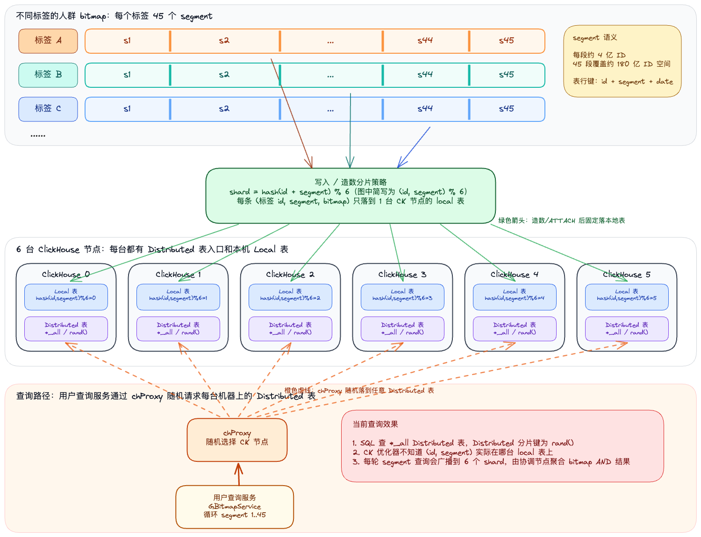
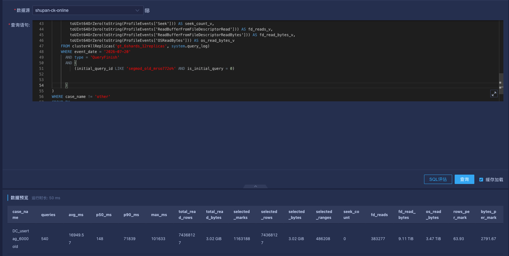
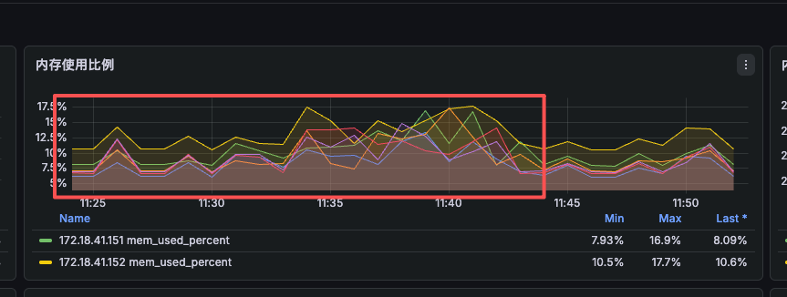
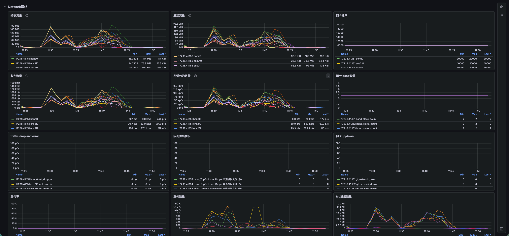
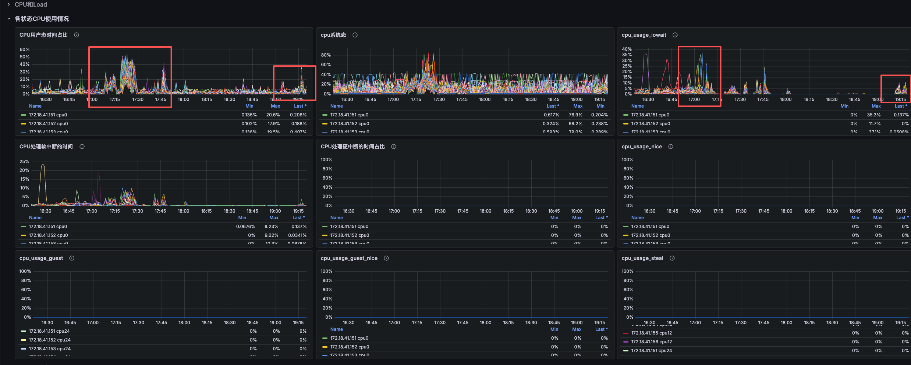
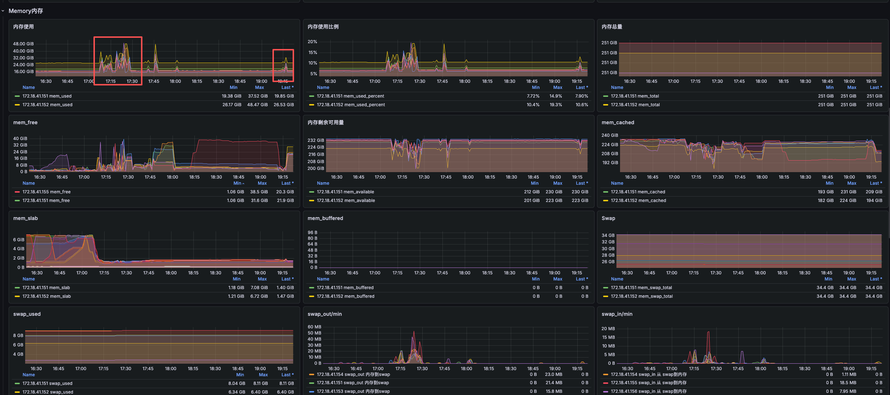
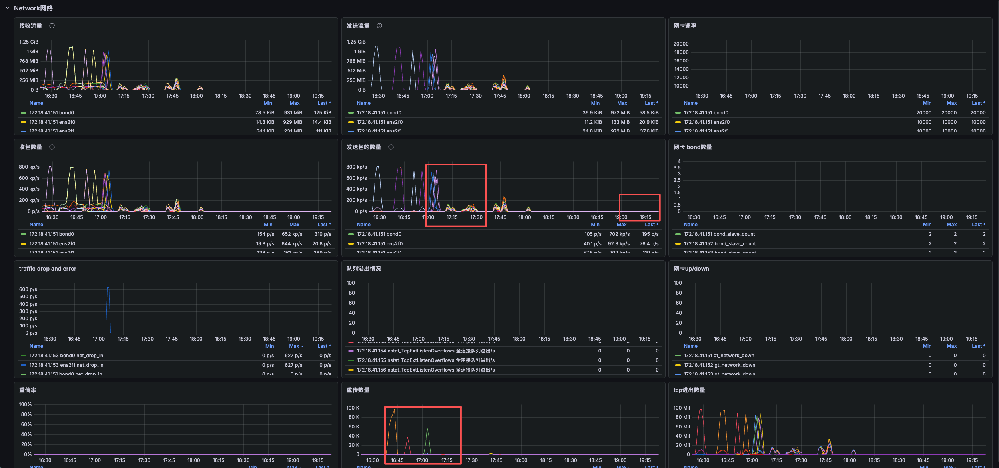
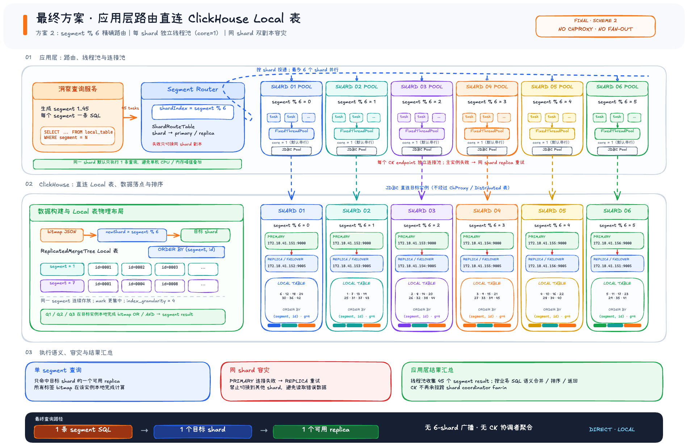

# 1.场景与问题
平台为百亿级用户画像平台，主要提供人群圈选与人群洞察（几十万标签）功能，要求“秒”级能生成人群，短时间内生成洞察结果并生成对应的报告。

- 人群圈选: 本质是通过标签构造群体集合，生成并持久化目标人群 bitmap，同时计算人数。底层每个标签对应一个用户位图集合： A = 男性用户 B = 杭州用户 C = 汽车兴趣用户 提人将 DSL 转成集合运算： 目标人群 T = A ∩ B ∩ C 底层通过 bitmap 的交集、并集、差集完成计算。
- 人群洞察: 本质是做集合的交叉统计，底层用目标人群bitmap与各画像标签bitmap 求交集，然后统计交集人数。假设目标人群是T，画像标签分别是D1、D2、D3，男性人数 = |T ∩ D1| ，25-34岁人数 = |T ∩ D2| ，高消费人数 = |T ∩ D3|

之前平台使用GreenPlum，基于PostgreSQL的一款OLTP分析引擎来进行bitmap计算，但因闭源与性能问题，改造为使用ClickHouse。但真正切换之后，发现
- 查询慢
- 系统不稳定，机器会宕机，需要应用层拆分小SQL执行，整体分析速度大大降低。

<!--more-->

# 2.当前方案


# 2.1 表定义
以一份基础标签为例子:
本地表:
```
  CREATE TABLE shupan.tb_sub_user_portrait_tags_bitmap
  ON CLUSTER gt_6shards_12replicas
  (
      id      String,
      segment UInt8,
      bitmap  AggregateFunction(groupBitmap, UInt32),
      date    Date
  )
  ENGINE = ReplicatedAggregatingMergeTree(
      '/clickhouse/tables/{shard}/shupan/tb_sub_user_portrait_tags_bitmap',
      '{replica}'
  )
  PARTITION BY date
  ORDER BY (id, segment)
  TTL date + toIntervalDay(15)
  SETTINGS index_granularity = 8192;
```
  字段含义：
  - id：画像标签 ID，例如年龄、性别、兴趣等标签值编码。
  - segment：用户 bitmap 分段编号，当前业务按 segment 分段计算。
  - bitmap：该标签、分段下的用户集合，存储的是 groupBitmap(UInt32) 聚合状态。
  - date：数据日期，也是分区字段。
  - TTL：数据保留 15 天。
  - index_granularity: granule大小，不过生成数据的时候用的64，并且限制了`max_bytes_to_merge_at_max_space_in_pool`的大小，所以不会合并part导致granule大小变大。
分布式表:
```
  CREATE TABLE shupan.tb_sub_user_portrait_tags_bitmap_all
  ON CLUSTER gt_6shards_12replicas
  AS shupan.tb_sub_user_portrait_tags_bitmap
  ENGINE = Distributed(
      gt_6shards_12replicas,
      shupan,
      tb_sub_user_portrait_tags_bitmap,
      rand()
  );
  
```

  _all 表本身不保存 bitmap 数据，而是把查询转发到
  gt_6shards_12replicas 集群中各 shard 的本地表。

  由于当前分片键是 rand()，查询 _all 表时一般无法根据
  id 或 segment 做 shard pruning，需要广播到全部 6 个 shard。
  
## 2.2 数据生产
- 读取数仓数据uid+tags 使用MapReduce生成id(id就是标签)+segment（分片一个segment 4亿人）+bitmapJson 落到HDFS中,并按ClickHouse 机器分好目录和数据。但为了让每台机器手上的数据均衡，分片方案采用`hash(id+segment) % 6` 计算该segment的标签会导入到哪台机器上。
- Spark工程读取bitmapJson数据，生成一个分区排序好的ckFile，上传到HDFS中。
- Clickhouse节点拉取HDFS中的属于本机器的ckFile，并attach

## 2.3 用户查询
- 应用层服务通过连接池控制多段segment的并发执行，连接通过chProxy负载均衡访问每台ClickHouse的节点上的分布式表来访问数据


# 3.问题分析




通过分析当前数据的parts信息，执行sql后的query信息、监控信息，可以得到当前方案的问题主要为:
- 使用了分布式表: 一条sql，需要通过所有机器才能计算出来结果，分布式表在大量id提人和洞察中查询次数过多（至少*6,复杂交并补更多），大量的网络传输以及协调者计算问题（因为在某个host的协调者，下达给6台机器sql，都无法单独计算出结果，必须返回子语句结果，协调者再计算，特别是洞察的场景下，都需要把每个标签的交集AggregateState都发送到协调者上去计算）
	- 协调者计算
	- 大量网络传输与重试
- pruning效果较差: 数据块以及表分片 pruning效果太差。分片层面需要每台机器都参与计算，单个机器层面 查找读取mark的数量和range（range也体现数据不连续）的数量都比较多，io和效率都不高。
	- 从排序键`<id,segment>`上来分析，每次查找同一段segment的id，都需要查找大量的在marks中查找
	- granule大小引发的读放大，标签大概率不会在一个granule里，但每次读取，会以granule为单位，整个文件读取，也就是为了读取一个标签的bitmap，需要读取64个bitmap的文件进行解压处理。

# 4.优化方案测试

从查询clcikhouse中的bitmap、计算的原理出发，分析现有数据查询的性能提升点。

## 4.1 优化方向

| 方向          | 尝试方案                                  | 结论           |
| ----------- | ------------------------------------- | ------------ |
| 分布式方案       | 使用segment分片，使用本地计算减少网络传输与协调者计算        | ✅            |
| 查找bitmap的速度 | order键切换`<segment,id>`                | ✅            |
|             | ck-file 不同parts之间的键`<id,segment>` 不重复 | ❌，查找快了，并行度低了 |
|             | guranule行数与大小                         | ✅            |
|             | 减少parts数量                             | ❌            |

## 4.2 测试效果
**查询速度**
以下为单条SQL的Avg加速比`<-1`表示回退

| 方案                          | 参数                   | 多标签计算   | 人群圈选(1000个标签) | 人群洞察（6000个标签） |
| --------------------------- | -------------------- | ------- | ------------- | ------------- |
| 基准                          | index_granularity=64 | 11330ms | 19729ms       | 73431ms       |
| 仅改为本地计算                     | index_granularity=64 | 1.62x   | 1.4x          | 1.88x         |
| 仅改index_granularity         | index_granularity=32 | 1.001x  | 1.361x        | 1.748x        |
|                             | index_granularity=16 | 2.316x  | 1.663x        | 2.319x        |
| ORDER BY                    | index_granularity=64 | 1.82x   | 1.16x         | 2.74x         |
|                             | index_granularity=16 | 3.51x   | 1.88x         | 3.15x         |
|                             | index_granularity=4  | 3.78x   | 2.38x         | 4.24x         |
| 本地表+order+idnex_granularity | index_granularity=64 | 2.45x   | 1.61x         | 4.33x         |
|                             | index_granularity=32 | 2.16x   | 1.69x         | 4.93x         |
|                             | index_granularity=4  | 4.98x   | 2.87x         | 8.34x         |

**内存情况**
以洞察6000个标签为例


| 方案                          | 参数                   | 主执行层        | 平均峰值               | 峰值范围              |
| --------------------------- | -------------------- | ----------- | ------------------ | ----------------- |
| 仅改为本地计算                     | index_granularity=64 | coordinator | 121.60 GiB（+96.5%） | 100.84~144.05 GiB |
| 仅改index_granularity         | index_granularity=32 | remote      | 33.11 GiB（-46.7%）  | 29.11~37.73 GiB   |
|                             | index_granularity=16 | remote      | 24.22 GiB（-60.9%）  | 19.06~31.93 GiB   |
| ORDER BY                    | index_granularity=64 | remote      | 15.65 GiB（-74.8%）  | 2.30~32.09 GiB    |
|                             | index_granularity=16 | remote      | 12.90 GiB（-79.2%）  | 2.06~26.57 GiB    |
|                             | index_granularity=4  | remote      | 8.81 GiB（-85.9%）   | 1.36~18.53 GiB    |
| 本地表+order+idnex_granularity | index_granularity=64 | coordinator | 38.67 GiB（-37.5%   | 8.76~76.82 GiB    |
|                             | index_granularity=32 | coordinator | 33.07 GiB（-46.7%）  | 6.40~63.55 GiB    |
|                             | index_granularity=4  | coordinator | 21.21 GiB（-66.0%）  | 2.55~40.84 GiB    |
注: 本地计算和分布式表不能同一拿峰值直接对比，本地表一条sql本地执行，分布式表将分为至少6条SQL到remote执行。

**监控**
对比`本地表+order+idnex_granularity=4`和当前方案的对比，17:00开始为线上方案方案，19:00为`本地表+order+idnex_granularity=4`方案。





# 5.优化方案

结合usertag表验证的结果，采用本地计算+修改order为`<segment,id>`+减少`index_granularity=4`会有一个比较好的效果。

直观效果:
- 1.洞察管理平台配置的标签7,510 个标签 164 秒完成。
- 2. 114,501 个品类标签 122秒 完成。




## 5.1 应用层改造

应用层需要知道集群信息，直接调用host上本地表

- 为每个host建立独立的连接池，且可以设置并发度core，默认为1，也就是只会往同一个host上执行一条查询。
- 实现容灾，比如shard5所在的主host挂了，知道shard5在host6上还有数据，可以切换到host6上查询。
- 提人（insert into shupan.tb_sub_prt_business_td_pan_bitmap）已经是写本地表，读分布式表
    
- 洞察直接使用本地表，需要应用层汇总所有shard上的结果，进行合并计算
    
- 查询时调大memory的限制，当前为20G

相当于把分布式表查找segment对应的shard在哪个host上的功能给实现了，但不涉及到bitmap的state网络传输

  

## 5.2 创建新表

新表需要按`<segment,id>` 排序

## 5.3 工程
- 生成bitmapjson文件时，shard文件夹内的数据需要按`segment % 6(shardNum)`分
- 写入新表结构按`<segment,id>`排序
- 工程生成时，为不同的表设置小一些的`index_granularity`,比如`usertag`表为4。但参考当前`granularity=4`的大小，为表设置`max_bytes_to_merge_at_max_space_in_pool`，而不是设置`max_bytes_to_merge_at_max_space_in_pool=0`，不让ClickHouse合并了。


## 5.4 扩容方案

比如扩到12个shard

- 新的分区工程生产12个shard的数据
- 新建集群及对应表
- 应用层切换新集群的表和集群信息

## 5.5 优缺点

优点：
- 计算速度快，clickhouse运行稳定
缺点:
- 应用层接管了Clickhouse分布式表的功能，耦合了集群信息，两边数据不能不一致

