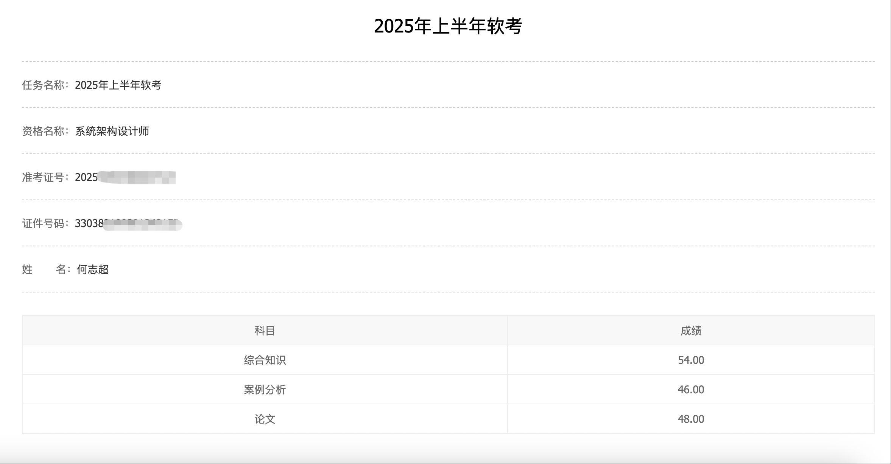
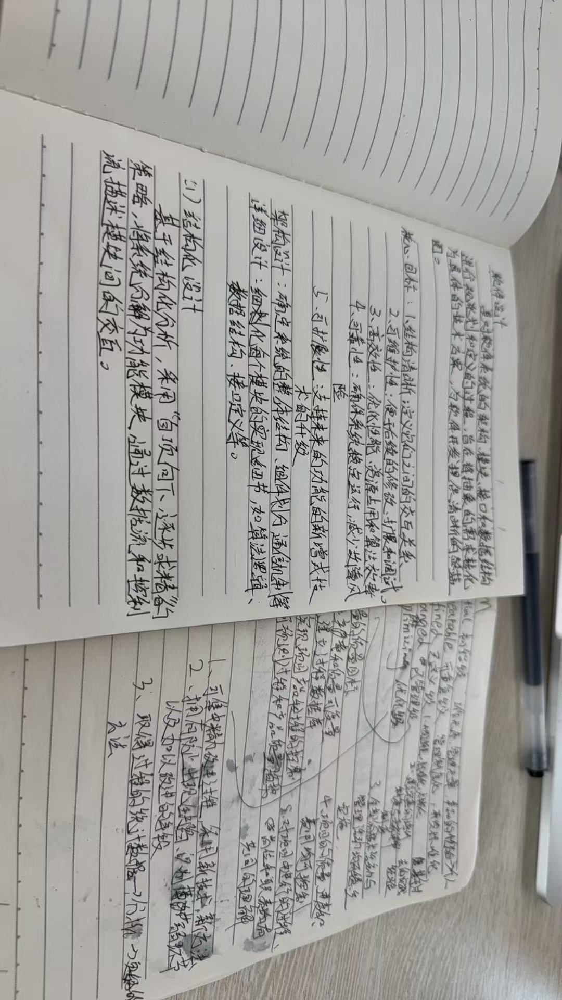
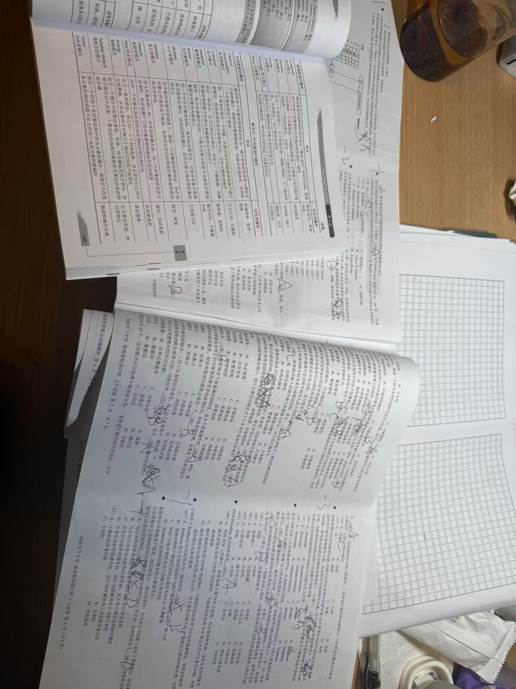
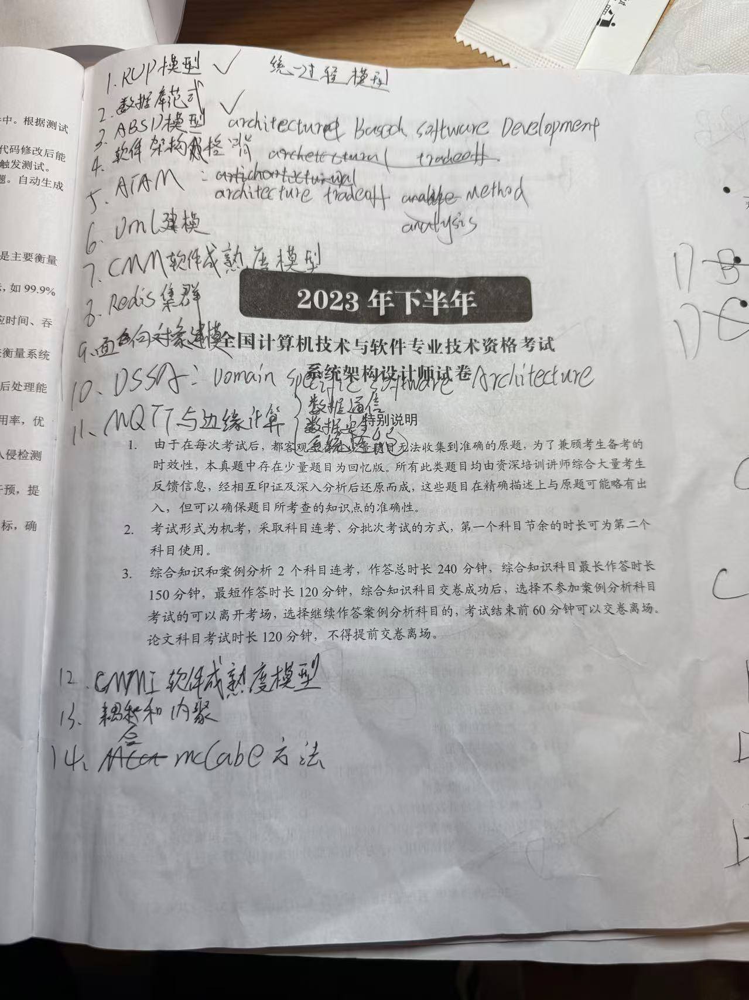
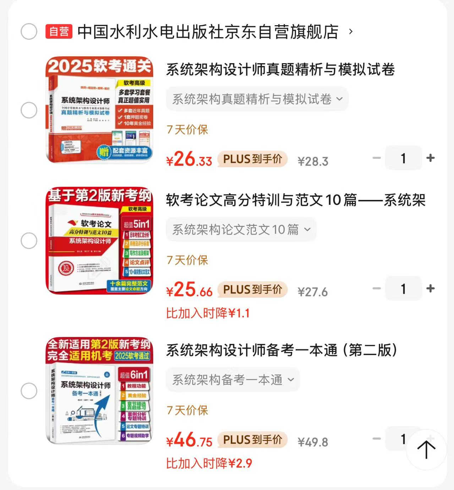
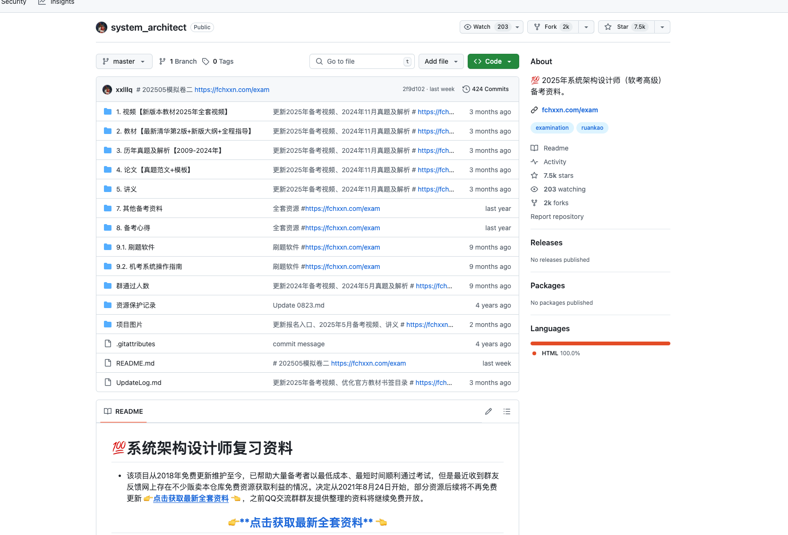
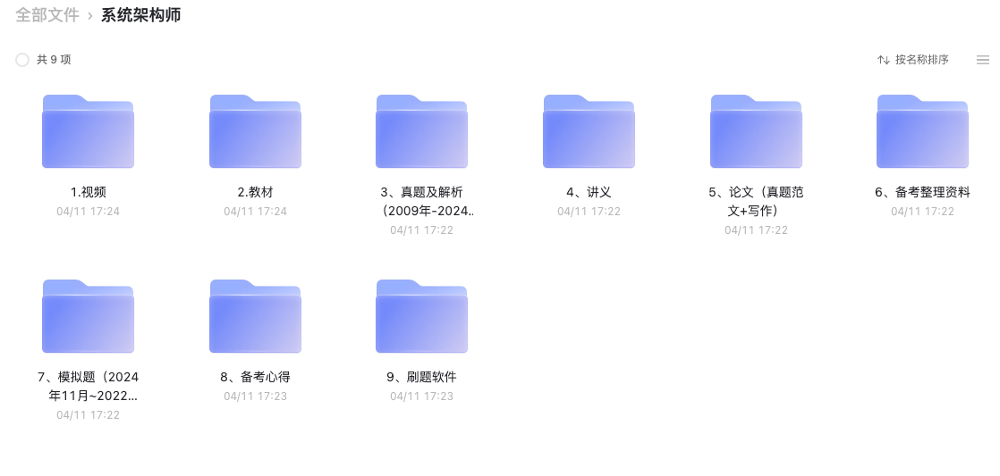

# 本文目的

- 对参加的2025年上半年系统架构设计师考试进行总结
- 提供一些备考思路给未来参加系统架构设计师的同学

<!-- more -->

# 个人背景

## 工作背景
本科计算机与技术（学过一些计算机基础课程），15年毕业后从事过b端（人群画像、营销、用户增长、硬件Iot等）、c端系统（旅游招聘领域）的开发与架构（有项目经验），带过研发、产品、运维、测试团队（项目开展流程、需求与项目管理等有了解），目前从事大数据计算、隐私计算等相关开发与管理工作。

## 软考经历
18年，19年做过三四年开发的时候报考过中级，裸考，一次早上综合知识科目44分，下午案例与编程60多分，另一次早上综合知识50多分，下午案例与编程43分均未过关。且后来觉得软考与实际工作无关，也就没有继续参加考试了。

## 本次成绩
本次是首次参加系统架构设计师的，大约备考了三周，每天2小时左右。综合知识符合预期，案例分析高于预期，论文低于预期。

# 软考的意义
之前我认为软考与开发工作本身关系不大，后来慢慢有所改观，除去地方政策所带来的一些福利外，本身软考还有一些其他的意义。
- **地方政策福利**: 通过软考高级，以考代评，一般具备副高职称。在杭州，通过软考高级+成果（软著或专利）可以申请杭州E类人才，享受一些补贴（租房、生活）与子女上学（用处不大）的政策。
- **个人综合素质体现**: 作为面试官，候选人工作背景、薪资要求、面试表现的能力差不多的时候，就会更侧重一些综合素质，如是否有或参与一些开源项目（体现空余时间是否有学习、参与一些项目开发，有自己的见解与产品能力），是否有blog（体现是否有学习和总结，以及一些深层次的思考），是否有一些算法比赛经历（体现大学期间的经历，思维与算法能力）。而软考证书和人才证书也是加分项，不但体现候选人在工作后有进行学习，而且也体现了学习或掌握了一些项目管理、需求管理、软件构建与迭代等系统架构师考试内容的方法论。
- **扩充知识体系**: 开发不仅仅是CRUD，Call Api，在生成式AI能力越来越强的背景下，对开发同学的要求也会越来越高。只会对普通系统的功能需求进行研发，注重研发边界，没有更高的产品意识和行业视野的同学面临的挑战会越来越大。系统架构师中对开发同学有提升的内容，比如计算机软件基础知识中的操作系统、软件工程、UML建模与设计模式、计算机网络与安全（在目前的工作中，容器化、云原生、数据保护，网络与安全方面的内容对我来说就比较重要）等，还有软件架构风格、特定领域的软件架构、软件架构评估（‼️特别重要，我们在架构一个软件时，应该设定什么标准、关注什么质量属性）。这些知识无疑是过去几十年来，领域专家或相关学者给出来较好的实践经验，可以作为一个理论基础，结合我们的实际工作过程与情况，调整优化。当然也有很多个人觉得过时的知识，比如J2EE、SOA架构，并没有特别花时间，主打就是考就看运气拿分。

# 总结与反思
首先，是通过了，后续就不需要花时间再去准备考试了。其实，虽然是通过了，但是也没达到原来预期的目标（玩笑：作为一个资深的开发人员，至少每门都是50+分数）。准备过程与考试过程有做的好的，也有不足的地方:
- [好]在准备阶段前期（大概是250415，距离考试一个月左右），就网上先看了下前辈的一些经验，结合自己的背景情况（每个人的情况都不一样，有的是应届生，没什么项目经验，有的甚至不是研发的同学），规划好了学习计划、学习资料，后续也是严格按照计划执行，在考试前也是达到了预期的状态。
- [好]不只是为了考试，同时在学习过程中也关注对自己工作有提升的内容，比如需求管理的一些活动，对比工作我是否有做到，哪些是我能采用的。再比如软件成熟度模型，我们现有的产品做到了哪一层，做到“优化级”成熟度我们还需要做到哪些点，如何做到这些点(虽然综合知识只考到了一道选择题，成熟度分为几层，秒选5)。再比如我们的项目迭代开展过程，和敏捷Scrum有什么优缺点，是否可以结合Scrum的一些机制和流程来优化我们的价值观和流程。
- [好]积极的做笔记与回顾，做了多年的真题（总结出可能哪些是考试的重点），论文针对过年五年的题目，预测过（个人预测的是安全架构，如何实现一个安全的软件，但是没考到）并提前写过并进行针对性修改和优化。
- [坏]第一次参加高级，对于时间的把控不是特别好，早上考两门综合知识与案例分析，没有仔细看过什么时候可以考案例分析，综合知识选择题基本是可以提前完成的，提前交卷之后我就趴在那里休息了。后来看到其他同学都写完案例分析的第一道题了，我才发现原来能考了，本次的案例个人觉得有点偏（和以前四年的试卷相比），顿时慌了，也就造成了此次案例分析分数较低（个人觉得是过不了的，估计大家都低，被捞上来的）。

# 备考方案
结合我自己本次的备考经验,主要从备考思路、时间安排、个人认为的考试重点、备考资料

## 备考思路
- **不要裸考，不要裸考，不要裸考**，裸考能过就是平时的积累够多+运气，软考一部分知识是偏理论的，工作过程中我觉得没有学习过相关的，我觉得是很难一次性考试通过的。高级的报名费从200出头涨到300块，个人觉得稍微花点时间，通过的几率增加，并且能在过程中有所收获，才不会浪费考试费用。
- 只是45分就过关，不要想着所有的知识都要会，一定要关注哪些是重点，大概率会出现，自己能拿分。比如计算机的一些内存管理计算、数学题（比如24年上的第9题，线性规划最优解）、项目规划最短时间、网络（如信号频率）等，我就战略性放弃了，在这些可能只会在综合知识出现一道题的内容，考到看运气，否则需要花费大量的时间，还不一定能做对。
- 综合知识: 考的知识点基本每年都差不多，比如基本都会考英语题（大多数是软件与架构或者数据存储相关的）、都会考软件著作权和商标相关的知识保护，大概率会考DSSA、构建、软件架构复用、架构风格、设计模式、耦合与内聚（本次25年上就考到了）、UML2.0消息等，写一遍历年真题，对高频出现的内容进行学习。
- 不要特意为案例分析和论文花特别多的时间，案例分析和论文不像综合知识，考点都是固定的。案例分析中第一题比较固定，质量属性填写或选择、场景适合的架构风格优缺点，基本有一道是嵌入式或硬件相关的，也有出现web系统、大数据、数据库和Redis等相关的题真题写一遍，剩下就看缘分了。25年上考到了知识图谱的实体关系、采用的存储以及爬虫架构，redis的主从流程。
- 论文: 论文可以形成自己的一个框架，摘要怎么写，正文开头如何介绍背景、项目功能，如何解答论文题目中的问题，在实际中的项目中如何运用，如何写结尾，对项目成功进行总结，以及还有哪些未完善的，未来如何改善。题目的话，可以准备一些热门的内容，如云计算、负载均衡、安全架构、微服务、可靠性设计、高维护性设计、软件系统测试等。25年上考到的是负载均衡（什么是动态负载、静态负载、场景负载）、AI结合测试（我选的是它）、事件驱动架构、多模态数据库及应用。考试前一定要自己练习过，可以让ai或者对比范围修改，不要第一次写论文出现在考场上。
- 案例和论文都需要背诵一些专业的解释，比如问xx在软件需求分析和设计阶段的作用或xx在架构上的作用，做好能回答出来什么是需求分析、设计阶段的目标、架构是什么，不仅显得回答更专业，也可以凑点字数。

## 考试重点
个人见解，仅供参考，就没分类了。

- RUP统一过程模型
- 数据库范式
- ABSD模型：基于架构的软件开发模型
- ATAM: 架构权衡分析方法
- UML建模
- CMMI软件成熟度模型
- Mysql与Redis 
- 面向对象建模、编程: 用例之间的关系、类之间的关系
- DSSA 特定领域软件架构
- 耦合与内聚
- 设计模式
- 软件建模
- 软件设计
- 软件架构
- 软件架构风格
- 敏捷开发与scrum
- 质量属性

## 时间安排
需要结合自己的情况，
- **备考规划(1-3天)**: 考虑好自己可以花多少时间投入，决心，备考策略，形成备考方案和计划、，如可以投入很多时间、开发经验较少的同学，买课，看视频慢慢学习可能是不错的方式。但是对于有开发经验的同学，更推荐看书，写真题，额外准备论文的扩展知识内容。

- **综合知识学习(1-2周)**: 先学习一遍综合知识的内容。

- **真题(1周)**: 学习过综合知识后，可以写一遍20年-25年的真题，对认为重要的，但是还薄弱的点进行强化学习。做完真题，其实已经过了一遍综合知识、案例分析、论文了。

- **论文准备(1周)**:  
    - 对历年真题，自己构思答题思路，不需要都写论文，看看思路和范文是否对应（没完全对应也没关系，答题点是对的，都能得分）。完成在这个阶段，应当具备看到题目，能快速形成思路和回答大纲的能力。
    - 在小红书或者相关论坛上看看对论文的题目预测，看看是否自己是否能写。最后挑选几篇，实战写下论文，并进行修改，在这个阶段最重要的是形成自己框架和套路，能保持论文整体的连贯，节约体系构思的时间来更好得回答问题。实际了解到很多同学考试的时候，都没办法做好论文的连贯性和条理，临时在那边凑字数，本次虽然分数不高，但是在1个小时20分钟内完成（不记得是2500还是更多的字了）。

## 备考资料

- 书: 《系统架构设计师备考一本通(第二版)》、《软考论文高分特训与范文10篇-系统架构设计师》、《系统架构设计师真题精析羽模拟试卷》，大概100块钱
- [希赛题库-每日一练](https://wangxiao.xisaiwang.com/tiku2/list-dp131.html?cstk=e350346988b149d5422f9cdb7dd25f2c&anyid=a84759c899ce40ab83dd6c39281e3006166886) 免费
- [github高start:system-architect](https://github.com/xxlllq/system_architect)，要钱 18块左右，来源不详，但是我没看过视频，只看过一些备考心得

