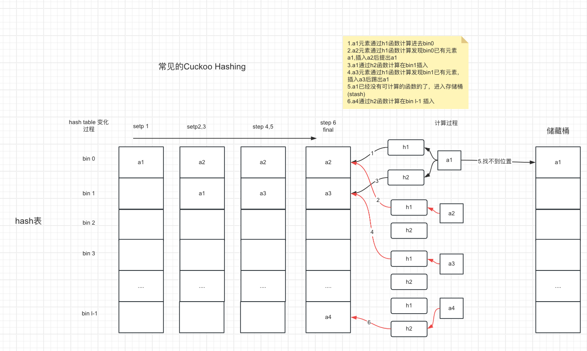

# 什么是PSI
隐私集合求交(Private Set Intersection)是指参与双方在不泄漏额外数据的情况下，得到双方持有数据的交集。
PSI在现实场景中非常有用，比如纵向联邦学习中，用于在多家厂商联合计算前，找到多家共有的数据样本，并且不暴露每家厂商独有的样本。或是在社交软件中，隐私联系人查找 。亦或是在广告业务中，去做人群交集。

我们可以用一种非常直观的方法来进行隐私集合求交，也就是**朴素哈希（simple hash）** 的方法。参与双方A、B，使用同一个哈希函数H，计算他们数据的哈希值，再将哈希过的数据互相发送给对方，然后就能求得交集了。

这种方法看起来非常简单、快速，但是，它是**不安全**的，有可能会泄露额外的信息。如果参与双方需要求交集的数据本身，数据空间比较小，比如说手机号、身份证号等，那么，一个恶意的参与方，就可以通过**哈希碰撞**的方式，在有限的时间内，碰撞出对方传过来的哈希值，从而窃取到额外的信息。因此，我们需要设计出更加安全的隐私集合求交的方法。
<!-- more -->

目前已经有很多方法来实现隐私集合求交，比如基于Diffie-Hellman密钥交换的方法、基于不经意传输的方法、基于同态加密计算等。而截至到目前，最快速的隐私求交方法，是基于不经意传输的。下面，我们介绍如何从解决 **百万富翁问题** 开始，构建一个不经意传输协议，实现隐私集合求交。

# 从百万富翁问题讲起

## 问题描述
Alice有`i`百万元，Bob有`j`百万元，为方便描述，我们限定`0 < i,j <=10`。现在想在不暴露`i`和`j`的情况下，比较`i`和`j`的大小。

## 解决思路

假设有10个宝箱，编号为1到10，Alice可以打开这10个箱子，而Bob不能。

**第一步**：

Alice找到编号为的箱子，并将编号为`i-1`到的箱子里都放个纸条"no"，编号为`i`到`10`的箱子里放个纸条"yes"，然后锁上箱子。

**第二步**：

Bob根据自己的资产`j`选择编号为`j`的箱子，并把这个箱子的编号撕掉并返回给Alice。（撕掉编号是为了让Alice也不知道Bob到底选了哪个箱子）

**第三步**：

Alice把Bob发的箱子打开，看一下里面的纸条，如果是"no"就说明 `j < i`, "yes"就说明`i >= j`。由此可以在互不知道对方财产的前提下，比较二人的财富。

以上描述的是一种实际的解决方案，那如何来构建这种**箱子**呢，下面用不经意查询（OT）来实现。

	以上过程很关键的一个点就是诚实选择，如Bob拥有`j`百万的资产，就选择`j`号箱子。

# 不经意查询OT
不经意传输协议, 也叫茫然传输协议, 是**一种保护隐私的两方通信协议**, 消息发送者持有两条待发送的消息, 接收者选择一条进行接收, 事后发送者对接收者获取哪一条消息毫不知情, 接收者对于未选择的消息也无法获取任何信息。

一种比较实用的不经意传输方案，被称为1-2不经意传输。发送方持有两个数据，接收方可以选择获取其中的一个，但是发送方并不知道接收方选择了哪一个数据。形式化描述如下：

发送方A持有数据m0和m1，接收方B持有一个比特b，b∈{0,1}，则1-2不经意传输可以描述为：

## RSA实现1-2OT
可以使用RSA协议来实现OT。
### RSA原理
生成密钥(d,e,N),其中`d`为私钥，`e`为公钥，`N`为明文模，其中e、N可分享给其他人。

**加密过程** 
$$cipherText = plainText ^ e  \mod  N $$

**解密过程**
$$plainText = cihperText ^ d \mod N$$

也就是 $$x = (x^d) ^e \mod  N$$

以上过程可知，RSA的加解密计算为幂模，计算速度相对对称加密(异或)会慢很多，通过`d`为一个大数，所以解密会比加密慢。

### 实现过程

**第一步**

Alice 拥有两条消息$m0$,$m1$,Bob会选择其中的一条，但是Bob又不想让Alice知道选择的是哪一条。

**第二步**
Alice 生成RSA密钥对:由明文模`N`,公钥`e`,私钥`d`构成

**第三步**
Alice 随机生成$x_0$,$x_1$,并将$x_0$,$x$与公钥$e$,明文模`N`一起发送给Bob

**第四步**
Bob从`0,1`中选择`b`(假设Bob对1条消息感兴趣，`b=1`)，并从$x_0$,$x_1$中选择$x_b$

**第五步**
Bob随机生成一个`k`值，计算出$$v=(x_b+k^e) \mod N$$，并且发送给Alice

**第六步**
Alice收到`v`值后，分别计算 $$k_0=(v-x_0)^d \mod N$$$$k_1=(v-x_1)^d \mod N$$$k_0$,$k_1$其中一个必然是Bob随机生成的k，假设`b=1`,则，k1会等于Bob生成的`k`

	这一步可以认为是在计算Bob生成的k，只不过只有一个是对的，但是Alice并不知道k0还是k1才是Bob的`k`

**第七步**
Alice再计算$$m'_0=(m_0+k_0) \mod N$$ $$m'_1=(m_1+k_1) \mod N$$
并将他们发送给Bob

	这一步可以认证在计算每一个Alice持有的消息与对应的Bob可能的k的和

**第八步**
Bob 计算$$m_b = m'_b -k$$Bob知道自己持有的k值，也知道b值，即知道该从$m'_0$还是 $m'_1$中获取，$m_b$即为Bob选择的消息

整个过程中，对于Alice，并不知道Bob选择的是哪个消息，保证了Bob的选择机密。而Bob也只拿到了自己选择的消息，对于接收到的`N`,e,$x_0$,$x_1$,$m'_0$,$m'_1$，无法算出除了选择的$m_b$消息之外的数据。如Bob选择了`b=1`,对于接收到的$$m'_0= ((x_0+k^e)-x_0 ) ^d + m_0  \mod N$$Bob不知道Alice的私钥`d`，所以也无法反推出$m_0$，保证了Alice被选择之外的机密的安全。

	 是不是有点index Pir的影子了，Alice为服务端，Bob为客户端，客户端通过索引查询服务端对应的数据(m0,m1)，服务端不知道客户端查询了哪些数据。

## 使用OT解决百万富翁问题

介绍了RSA实现OT后，我们可以先忘记OT的实现细节，把OT当成一个黑盒协议，Bob可以获取到自己想要的数据，而Alice不知道Bob的选择，根据此协议，我们扩展消息m的数量为10个消息m的内容选项为`less,equal,more'

$$
m_i=
\begin{cases}
less, & \text{if i < 资产数} \\\\
equals, & \text{if i = 资产数} \\\\
more, & \text{if i > 资产数 }

\end{cases}

$$
假设Alice有500百万，则构建的消息m为`{less,less,less,less,equal,more,more ,more,more,more}`。

	 示例m数组中，m0-m4的消息都有less，m5-m10都为more Bob可以通过观察收到的m'0-m'10知道Alice的资产情况吗?结果是不知道，因为会随机生成x0-x10,最后Bob收到的m'0-m'10其实是没有什么规律的

Bob通过OT协议，选择自己资产数对应的消息mb，如果是more的话，就是Bob的资产多于Alice，是equal的话，就是双方资产一样多，是less的话，就是Bob的资产少于Alice。如Bob的资产是600百万，则Bob通过OT协议将会获取m6的值 `more`,就知道自己的资产比较多。这样双方在没有透入自己资产的情况下，比较出了谁的资产更多。

# 使用OT实现隐私比较

百万富翁问题中比较的是大小，实际PSI中比较的是双方的数据是否相等，把相等的交集（或者不想等的差集）提取出来。其实核心就是隐私比较问题。
如果能实现两个元素的`equals`方法，也就能两个集合的`intersection`方法。

## 比较一个bit
简化场景为双方都持有一个bit数据（0或者1），比较双方持有的bit是否一致。

**第一步**
alice生成两个随机消息$m_0$,$m_1$ 并发送给Bob

**第二步**
Bob通过OT协议（除RSA实现实现外，也可以通过椭圆曲线加密ECC、DH密钥交换协议)获取到持有bit对应的消息my，比如持有bit为1，则选择$m_1$

**第三步**
Alice也选择自己持有bit对应的消息$m_x$，并对比$m_y$是否相等，相等则说明双方的数据一致。

	关于选择，双方都选择自己bit值对应的消息。

## 比较一个字符串
字符串是一个二进制串(bit数组，如0010100 110000)，PSI常用的长度是128bit。我们先假设x与y的长度一致(实际情况也是一致的，通常不会比较原始数据，比如先做朴素hash处理，再进行PSI)。字符串比较与bit比较相似，相当于做了l次OT。与bit比较有区别的是:
- 把Alice生成的$m_0$，$m_1$扩展成$m_0\_arr$($m_0\_0$,$m_0\_1$,$m_0\_2$....$m_0\_(l-1)$),$m_1\_arr$($m_1\_0$,$m_1\_1$,$m_1\_2$.....$m_1\_(l-1)$)，长度都为字符串bit的数量`l`,对于每一个bit数x，都选择$m_x\_arr$中第index位的消息,这样双方都能获取都l个消息。Bob需要通过OT获取到对应的消息
- 比较时，双方都将各自手上的l个消息做异或，生成一个比较串，如果一致，则说明双方持有的字符串一致。

**实际操作如下**

*第一步*
Alice生成两个二进制串(服从均匀分布)数组$m_0\_arr$与$m_1\_arr$，长度为持有的字符串长度l。

*第二步*
Bob遍历持有的字符串的每一个bit，进行一次OT协议，选择的是当前bit索引index与value对应的$m_{value}\_arr[index]$的二进制串。比如Bob持有的字符串，index为5的bit值为1，Alice将会选择$m_1\_arr$中index为5的消息$m_1\_5$。最终Bob将会获取到l个二进制串，异或得到一个二进制串$K_y$。

*第三步*
Alice遍历持有的字符串的每一个bit，不需要进行OT，选择当前bit索引index与value对应的$m_{value}\_arr[index]$的二进制串。最终Alice得到`l`个二进制串，异或得到一个二进制串$K_x$，将$K_x$发送给Bob

*第四步*
Bob比较$K_x$与$K_y$是否一致，即可判断双方的字符串是否一致

	 为什么对l个二进制串做异或比较，而不是比较每一位是否一致？位是非0即1的，位比较如果不相同，我也能知道你是什么内容，如果二进制串的比较是比较每个位，将能通过比较知道，对方的每一位与我是否一致，如果我是0，你和我不一样，那你这一位就是1，我就能知道你的原始字符串。

# 从OT到不经意伪随机函数OPRF

通过字符串隐私比较，我们可以发现，Alice持有两组二进制串，$m_0\_arr$和$m_1\_arr$，我们可以将这些二进制串整体当作一个随机串`k`，由Alice持有。从Bob的角度，隐私比较的过程就是输入了持有的数据串，得到一个随机的二进制串$K_y$，这个随机的二进制串由Alice持有的随机种子`k`与输入的数据决定，同时Alice无法无法得到Bob的输入。这一过程，就可以看作是*不经意伪随机函数(Oblivios Pseudo Random Function)* 。

	OPRF可以认为是OT更高层次的抽象，从使用上也可以当作一个黑盒

## 使用OPRF进行PSI
假设Alice持有一组输入X，Bob持有一组输入Y，`|X| = |Y| = n`。通过不经意伪随机函数，我们可以构造出一个类似朴素Hash的隐私集合求交:

Bob为Y中的每一个元素y,分别对Alice集合X中的每一个元素进行一次OPRF比较，如果有相同的结果，则元素y为双方形同的元素。
实际Alice的每个元素都和Bob的每个元素都进行一次隐私比较，相当于两次for循环，开销很大，复杂度为$O(n^2)$，可以通过Cuckoo Hashing来降低比较的次数，从而降低计算的复杂度为$O(n)$。

	 比较次数少了，意味着进行OPRF协议的次数也少了，传输量同样也降低了

# 优化
##  使用cuckoo hashing

### cuckoo hashing介绍
Cuckoo中文名叫布谷鸟，这种鸟有一种即狡猾又贪婪的习性，它不肯自己筑巢， 而是把蛋下到别的鸟巢里，而且它的幼鸟又会比别的鸟早出生，布谷幼鸟天生有一种残忍的动作，幼鸟会拼命把未出生的其它鸟蛋挤出窝巢，今后以便独享“养父 母”的食物。借助生物学上这一典故，cuckoo hashing处理碰撞的方法，就是把原来占用位置的这个元素踢走，不过被踢出去的元素还要比鸟蛋幸运，因为它还有一个备用位置可以安置，如果备用位置上 还有人，再把它踢走，如此往复。直到被踢的次数达到一个上限，才确认哈希表已满，并执行rehash操作。

### cuckoo hashing优化流程

cuckoo hashing的变种很多，常见的为使用单bin（桶）和一个stash(储藏桶)。以下举例为多bin且不使用stash（stash-less Cuckoo Hashing）,比较好理解如何减少传输量和计算量。[microsoft/apsi](https://github.com/microsoft/APSI?tab=readme-ov-file#cuckoo-hashing)使用Cuckoo Hashing对多项式计算中降低同态计算速度与计算量的优化使用了该结构,隐语spu中对kkrt16协议也同样使用stash-less的方式进行了优化。
KKRT16算法或者[隐私集合求交（PSI)](https://www.cnblogs.com/pam-sh/p/16155650.html#cuckoo-hash)中的示例作者是使用单bin（大小为1.2l）、一个stash（大小为s）实现。

**构建与比较过程**
- Alice和Bob共同选择两个哈希函数h1,h2
- Alice生成l个OPRF种子
- Alice将集合Ha中所有元素，分别执行h1,h2函数插入。遇到位置冲突的，不使用Cuckoo Hashing的剔除元素重复执行特性，而是放到索引位相同的其他bin中
- Alice对所有bin中的元素进行OPRF计算（本地计算），索引为index的bins都使用同一个OPRF 种子，Alice将得到的bin bundle(桶集合，内容为执行为OPRF协议后的数据)发送给Bob
- Bob将集合Hb中所有元素，随机选择h1，h2函数中的一个计算插入。遇到位置冲突的，改用另一个函数插入，再冲突就剔出冲突元素，冲突数据再选择别的函数插入。（都不行，rehash）。
- Bob遍历Cuckoo Hashing中的元素，与Alice进行OPRF协议计算，结算结果与Alice发送过来的Cuckoo Hashing中对应索引位的（可能为多个）数据进行比较，如果命中，则该元素为双方共同持有

	示例中原来需要进行6（3*2）次OPRF传输计算与比较，现在只需要3次，减少了传输量和计算量

# 总结
以上，我们基本实现了通过OPRF（base OT）来实现PSI计算，并通过Cuckoo Hashing来减少计算量和传输量，实现原理基本上与KKRT16协议（Batched Oblivious PRF）相似，常规的KKRT16协议在大集合、局域网下运行效果较好，$2^{20}$（百万）的数据集可以在4s内完成psi，$2^{24}$(千万)的数据集可以在48s内完成psi。但以上实现传输量较大，对于跨机房，小带宽的网络并不友好，整体Psi计算耗时太长，可以考虑同态计算(HE)的一些方案。

# 参考
- [一起学MPC：（一）百万富翁问题](https://mp.weixin.qq.com/s/jdFjtG3yza57dAFbx2rd4Q)
- [隐私集合求交（PSI）-两方](https://www.cnblogs.com/pam-sh/p/16155650.html)
- [microsoft/apsi](https://github.com/microsoft/APSI)
- [KKRT-PSI](https://www.cnblogs.com/pam-sh/p/17431388.html)

